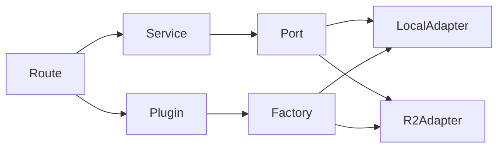

# API — Inversão de dependência (Ports & Adapters)

A API Fastify (`apps/api`) adota **inversão de dependência** para integrações externas: storage, e-mail, gateways de pagamento, filas, etc.

## Estrutura

```
apps/api/src/
  ports/           # contratos (interfaces)
  adapters/        # implementações concretas
  plugins/         # injeção no Fastify (app.decorate)
  modules/         # domínio — recebe ports por parâmetro, sem SDK direto
```

## Fluxo



1. **Factory** lê `process.env` e instancia o adapter.
2. **Plugin** registra `app.imageStorage` (ou outra port).
3. **Route** chama `service(db, request.server.imageStorage, ...)`.
4. **Service** usa apenas a interface `ImageStorage`.

## Storage de imagens

| Provider | Env | Uso |
|----------|-----|-----|
| `local` (default) | `UPLOAD_DIR` | Dev, testes, imagens legadas em disco |
| `r2` | ver abaixo | Produção — Cloudflare R2 |

### Variáveis R2

```env
STORAGE_PROVIDER=r2
R2_DELIVERY=proxy          # Render sem domínio customizado (recomendado agora)
R2_ACCOUNT_ID=66836ec0393e82929ae0c3090b013f9d
R2_BUCKET=ata-commerce
R2_ACCESS_KEY_ID=...
R2_SECRET_ACCESS_KEY=...
```

#### Modos de entrega (`R2_DELIVERY`)

| Modo | Quando usar | Public Development URL | `R2_PUBLIC_URL` |
|------|-------------|------------------------|-----------------|
| **`proxy`** (default) | Render free, sem domínio | **Desligada** — bucket privado | Não precisa |
| **`cdn`** | Produção com domínio customizado no R2 | Não usar `*.r2.dev` | Domínio customizado |

**Modo proxy (seu caso hoje):**
- Upload vai para o R2 (persistente, sobrevive a redeploys no Render).
- Banco guarda `/images/{arquivo}` (igual antes).
- Browser pede imagem à API (`https://lojao-api.onrender.com/images/...`).
- Admin/storefront já resolvem via `VITE_API_URL` / proxy Next — **nada muda nas URLs do admin e storefront**.

**Modo cdn (futuro):**
- Configure custom domain no R2 (ex. `cdn.seudominio.com`).
- `R2_DELIVERY=cdn` + `R2_PUBLIC_URL=https://cdn.seudominio.com`.
- Novos uploads retornam URL direta do CDN; imagens antigas em `/images/...` continuam via proxy.

- **Endpoint S3** (upload/delete/leitura): `https://{R2_ACCOUNT_ID}.r2.cloudflarestorage.com`
- Objetos gravados em `images/{timestamp}.webp` (upload otimizado: resize max 1920px + WebP).
- Imagens legadas em disco local continuam servidas antes de consultar o R2.

## Adicionar novo provider de storage

1. Criar `src/adapters/storage/novo-provider-storage.ts` implementando `ImageStorage`.
2. Registrar na factory `create-image-storage.ts`.
3. Documentar env em `.env.example`.
4. **Não** alterar `banners.service.ts`, `produtos.service.ts`, etc.

## Adicionar nova integração (padrão geral)

1. Definir port em `src/ports/nome.ts`.
2. Implementar adapters em `src/adapters/nome/`.
3. Factory + plugin Fastify.
4. Services recebem a port; rotas injetam de `request.server`.

Regra Cursor: `.cursor/rules/api-dependency-inversion.mdc`.
