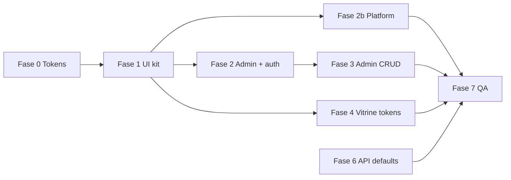

# Plano — Design System 100% + temas escuro/claro precisos

| Campo | Valor |
|-------|-------|
| **Objetivo** | UI 100% alinhada ao manual PDF + toggle light/dark no **admin** (e Platform Hub) |
| **Fonte de verdade** | `docs/design/AtaLabs - Identidade Visual new.pdf` → `docs/specs/design-system.md` → `packages/design-tokens/` |
| **Status** | Fase 7 **concluída** — migração design system 100% |
| **Estimativa** | 3–5 sessões (foundation → UI kit → admin + platform → vitrine tokens → QA) |

---

## 1. Diagnóstico (estado atual)

### O que já está certo

- Tokens base `--ata-azul-*` e `--ata-verde-*` em `packages/design-tokens/src/ata-*.css` (hex do manual).
- Marketing (landing, pricing, signup) majoritariamente em paleta Ata Labs / Ata Commerce.
- Toggle escuro/claro no **admin** (localStorage). Vitrine: **sem toggle** nesta entrega.

### Débito técnico conhecido

| Implementação atual | Situação | Ação agora |
|---------------------|----------|------------|
| `loja_tema` em `configuracoes` + toggle em Aparência | Modelo ainda indefinido para vitrine | **Manter** até spec futura via tabela Aparência (§2.4); não remover na Fase 6 |
| Overrides `!important` em theme CSS | Gambiarra | Substituir por tokens semânticos + componentes (admin primeiro) |

| Problema | Impacto |
|----------|---------|
| **~400+ usos de `gray-*` / `blue-*` / `#2563eb`** no admin e vitrine | Cores fora do manual; toggle depende de hacks CSS (`!important`) |
| **Overrides CSS** em `admin-ui-theme.css` / `store-ui-theme.css` | Só remapeia algumas classes; gráficos, badges, estados hover ficam incoerentes |
| **Tokens semânticos incompletos** | Faltam `--admin-*` / `--store-*` para: tabela, badge, chart, focus, erro, sucesso |
| **`#0a1f5c` hardcoded** | Vem do gradiente hero — ok no manual, mas deve ser token nomeado (`--ata-azul-meia-noite` ou reutilizar gradiente) |
| **`packages/ui` parcial** | `Card` usa vars; `Button`, `Table`, `ChartCard` ainda usam gray/blue genéricos |
| **Platform Hub (verde)** | Sem `--platform-*` espelhando `--ata-verde-*` com modo claro |
| **Sem lint/grep de regressão** | Novo código volta a usar `gray-500` |

### Escopo numérico (aprox.)

| Área | Arquivos com cores legadas |
|------|----------------------------|
| Admin rotas | ~24 arquivos |
| Storefront vitrine/checkout | ~20 arquivos |
| `@lojao/ui` | 3 componentes |
| API defaults (`#2563eb`) | seed, aparencia, public — trocar para `#0D5FE0` |

---

## 2. Arquitetura alvo

### 2.1 Escopo atual vs futuro (decisão de produto — fechada)

| Conceito | Escopo **agora** | Escopo **futuro** (vitrine) |
|----------|------------------|-----------------------------|
| **Light/dark (UI)** | **Só admin** (+ login, my-stores) e **Platform Hub** | Vitrine: **fora de escopo** — sem toggle visitante |
| **Aparência (branding)** | Lojista edita logo, nome, cor primária CTAs, etc. | Mesmo; eventualmente incluir **tema da vitrine** (`escuro`/`claro` ou variantes) via tabela **Aparência** / `configuracoes` |

**Regras agora:**

- Toggle light/dark **não** existe na vitrine (visitante nem lojista na loja pública).
- Aparência **≠** toggle do painel admin — são produtos diferentes.
- `cor_primaria` do lojista colore **CTAs/badge da marca** na vitrine; não substitui paleta estrutural do admin.

### 2.2 Dois contextos de light/dark (entrega atual)

| App | Atributo HTML | Storage key | Paleta claro | Paleta escuro |
|-----|---------------|-------------|--------------|---------------|
| **Admin** (incl. `/login`, `/admin/my-stores`) | `data-admin-ui-theme` | `ata-admin-ui-theme` | Ata Commerce azul-nevoa | Ata Commerce azul-noite |
| **Platform Hub** | `data-platform-ui-theme` | `ata-platform-ui-theme` | Ata Labs creme/branco | Ata Labs verde-conde |

Opcional fase posterior: respeitar `prefers-color-scheme` antes do primeiro toggle manual.

### 2.3 Vitrine — fora de escopo light/dark (nota para spec futura)

**Nesta entrega:** vitrine permanece com aparência atual (tokens `--store-*` + `--cor-primaria` tenant); **sem** toggle no header e **sem** `localStorage` de tema.

**Futuro (via Aparência / `configuracoes`):**

- Lojista define **como a loja aparece** para visitantes — possivelmente incluindo modo escuro/claro da vitrine, não preferência do visitante.
- Campos candidatos: evoluir `loja_tema` ou renomear (`loja_modo_vitrine`, `loja_paleta`, etc.) na mesma tabela/API de Aparência.
- Visitante **não** troca tema na loja; só vê o que o lojista configurou (alinhado a demo: visitante não edita Aparência).
- Separar sempre: **branding** (logo, cor CTA) vs **shell da vitrine** (fundo, cards, texto) — ambos podem vir da Aparência, mas não do toggle do admin.

Spec detalhada: **backlog** — documentar em `design-system.md` §11 quando priorizado.

### 2.4 Camadas de token (3 níveis)

```
Nível 1 — Primitivos (manual PDF, imutáveis)
  --ata-azul-noite, --ata-verde-broto, …

Nível 2 — Semânticos por produto
  Admin:     --admin-*     via data-admin-ui-theme (light/dark)
  Platform:  --platform-*  via data-platform-ui-theme (light/dark)
  Store:     --store-*     fixo por tenant hoje; futuro via Aparência (§2.3)
  Aparência: --cor-primaria tenant — CTAs vitrine, não fundo admin

Nível 3 — Componentes (consomem Nível 2)
  .ds-card, .ds-input, .ds-table-row, Button variants, …
```

### Regras invioláveis

1. **Proibido** em apps novos: `gray-*`, `blue-*`, hex solto (exceto `#ffffff` / `#000000` quando manual exigir).
2. **Toggle light/dark** só no admin e Platform Hub — altera `data-admin-ui-theme` / `data-platform-ui-theme`; zero lógica de cor em TSX.
3. **Vitrine:** sem toggle nesta entrega; não implementar `data-store-ui-theme` / `localStorage` visitante.
4. **Remover** blocos `!important` de remapeamento quando páginas usarem tokens semânticos.
5. **Ata Commerce** = azul dominante; **Ata Labs** = verde; nunca misturar dominante errado por rota.
6. **Contraste WCAG AA** mínimo em ambos os temas admin/platform (texto principal ≥ 4.5:1).

### Mapa escuro / claro (Ata Commerce — referência)

| Papel | Escuro | Claro |
|-------|--------|-------|
| Fundo app | `#0a1f5c` (token gradiente início) | `--ata-azul-nevoa` |
| Superfície (card) | `--ata-azul-noite` | `#ffffff` |
| Texto principal | `#ffffff` | `--ata-azul-noite` |
| Texto secundário | `--ata-azul-ceu` | `color-mix(azul-noite 70%)` |
| Borda | `azul-comercio @ 25%` | `--ata-azul-gelo` |
| CTA / switch on | `--ata-azul-comercio` | `--ata-azul-comercio` |
| Link / hover | `--ata-azul-vivido` | `--ata-azul-comercio` |
| Input fundo | `azul-noite escurecido` | `#ffffff` |
| Sidebar | `--ata-azul-noite` | `#ffffff` |

Documentar esta tabela em `design-system.md` §11 após validação visual contra PDF.

### Mapa escuro / claro — Platform Hub (Ata Labs)

| Papel | Escuro | Claro |
|-------|--------|-------|
| Fundo app | `#0d2002` / gradiente hero | `--ata-creme` |
| Superfície | `--ata-verde-conde` | `#ffffff` |
| Texto principal | `--ata-creme` | `--ata-verde-conde` |
| CTA | `--ata-verde-broto` | `--ata-verde-broto` |
| Borda | `verde-broto @ 20%` | `--ata-cinza-areia` |

---

## 3. Fases de execução

### Fase 0 — Fundação tokens (0,5–1 sessão) ✅

**Entregáveis**

- [x] `packages/design-tokens/src/primitives.css` — reexporta ata-labs + ata-commerce (opcional refactor).
- [x] `packages/design-tokens/src/semantic-admin.css` — todas `--admin-*` escuro + claro (substitui `admin-ui-theme.css`).
- [x] `semantic-store.css` — `--store-*` para vitrine (tokens estruturais; **sem** par claro/escuro visitante nesta entrega).
- [x] Token `--ata-azul-hero-inicio: #0a1f5c` no `ata-commerce.css` (nome oficial no design-system).
- [x] `semantic-platform.css` — `--platform-*` verde + claro creme (**obrigatório**, mesma entrega).
- [x] `packages/design-tokens/src/components.css` — classes utilitárias `.ds-*` (input, card, muted-text, table).
- [x] Atualizar `design-system.md` §11 “Temas semânticos” + tabela escuro/claro.
- [x] Script CI: `scripts/check-design-tokens.sh` — falha se `gray-[0-9]` ou `#2563eb` em `apps/admin`, `apps/storefront`, `packages/ui`.

**DoD:** typecheck ok; grep legado documentado; zero `!important` nos semantic CSS (só vars).

**Log 2026-06-23:** baseline 565 ocorrências legadas; overrides `!important` isolados em `admin-ui-theme.css` / `store-ui-theme.css`; `make check-design` adicionado.

---

### Fase 1 — UI kit `@lojao/ui` (1 sessão) ✅

**Arquivos:** `card.tsx`, `button.tsx`, `table.tsx`, `chart-card.tsx`, `switch.tsx`, `sidebar.tsx`, `layout-admin.tsx`.

- [x] Todos os componentes usam `var(--admin-*)` ou props `surface="admin"` (commerce vs platform).
- [x] `Button`: variants `primary` → azul-comercio / verde-broto; `ghost` → semantic hover.
- [x] `Table`: header/row/border via tokens.
- [x] `ChartCard` + tooltip Recharts: cores via CSS vars (dashboard).
- [x] Exportar helpers TS: `adminInputClass`, `adminMutedClass` (espelho de `authInputClass` em `ata-brand.tsx`).

**DoD:** Storybook mínimo ou página `/admin/diagnostico` com swatch de todos os tokens (opcional mas recomendado).

**Log 2026-06-23:** `surface.ts`, `chart-theme.ts`, swatch em `/admin/diagnostico`; gráficos usam `useChartTheme()`.

---

### Fase 2 — Admin auth + shell (0,5 sessão) ✅

**Arquivos:** `ata-brand.tsx`, `login.tsx`, `my-stores.tsx`, `admin/layout.tsx`, `index.css`, `admin-ui-theme.tsx`.

- [x] **Login e my-stores seguem o toggle** (`data-admin-ui-theme` no `<html>` antes do paint).
- [x] Auth shell (`authShellClass`, `merchantHubShellClass`) usa `--admin-*`, não cores fixas.
- [x] Sidebar nav: tokens semantic active/hover.
- [x] Remover overrides `!important` conforme páginas migrarem.

**DoD:** escuro/claro coerente em login → hub → dashboard; screenshot anexo.

**Log 2026-06-23:** script blocking em `index.html`; classes `.admin-auth-shell` / `.admin-hub-card`; overrides `aside` removidos; toggle em login + my-stores.

---

### Fase 2b — Platform Hub (0,5 sessão) — mesma entrega ✅

**Arquivos:** `platform/layout.tsx`, `platform-ui-theme.tsx`, `semantic-platform.css`.

- [x] Toggle claro **verde/creme** (Ata Labs) no sidebar platform.
- [x] `data-platform-ui-theme` + `--platform-*`.
- [x] Tenants CRUD sem `gray-*`.

**DoD:** platform escuro/claro coerente com landing Ata Labs.

**Log 2026-06-23:** `PlatformUiThemeProvider`, toggle login + sidebar; tenants CRUD migrado; shells `.platform-auth-shell`.

---

### Fase 3 — Admin módulos CRUD (2 sessões) ✅

Migrar **módulo a módulo** (reduz risco):

| Ordem | Módulo | Arquivos principais |
|-------|--------|---------------------|
| 3.1 | Aparência | `aparencia/index.tsx` — branding; **`loja_tema` mantido** até spec vitrine (§2.3) |
| 3.2 | Dashboard + charts | `dashboard.tsx`, `dashboard-charts.tsx`, `chart-utils.ts` |
| 3.3 | Produtos + categorias | `produtos/*`, `categorias/*` |
| 3.4 | Pedidos | `pedidos.tsx`, `detail.tsx` |
| 3.5 | Config + restantes | `configuracoes`, `banners`, `chat`, `agenda`, … |

Por arquivo:

1. Substituir `text-white` → `text-[var(--admin-text)]` ou classe `.ds-text`.
2. Substituir inputs por `adminInputClass`.
3. Badges de status: mapa fixo usando azul/verde/semantic (não `bg-green-900` genérico sem token).

**DoD por módulo:** zero `gray-*` no path; smoke Playwright admin passa; vitest inalterado.

**Log 2026-06-23:** `admin-styles.ts` (helpers compartilhados); 19 rotas admin migradas; admin CRUD zero `gray-*`/`blue-*`; baseline 90 (restante: storefront).

---

### Fase 4 — Vitrine tokens (1 sessão) — **sem toggle** ✅

**Escopo:** migrar cores legadas para `--store-*` e `--cor-primaria`; **não** implementar light/dark visitante.

**Arquivos:** layout store, `product-*`, `cart-*`, `checkout-*`, `globals.css`.

- [x] `--cor-primaria` tenant só em CTAs; tokens `--store-*` para estrutura.
- [x] Remover `gray-*` / `#2563eb` na vitrine.
- [x] **Não** adicionar toggle no header nem `data-store-ui-theme`.
- [x] Manter leitura de `loja_tema` da API se já existir (comportamento atual) até spec Aparência futura.

**DoD:** vitrine coerente com design tokens; E2E smoke; contraste AA no modo atual da loja.

**Log 2026-06-23:** `store-styles.ts` (helpers vitrine); 22 arquivos `/store/*` + componentes migrados; `globals.css` importa `semantic-store.css`; `store-ui-theme.css` reduzido a re-export; baseline **0** em admin/storefront/ui; typecheck storefront OK.

---

### ~~Fase 5 — Platform Hub~~

Movido para **Fase 2b** (mesma entrega, não opcional).

---

### Fase 6 — API e defaults (0,25 sessão) ✅

- [x] `loja_cor_primaria` default `#0D5FE0` em todo lugar.
- [x] **`loja_tema`:** não remover nesta entrega — evoluir na spec Aparência vitrine (§2.3).
- [x] OpenAPI / emails — sem cores, só nomes de marca.

**Log 2026-06-23:** `DEFAULT_LOJA_COR_PRIMARIA` centralizado em `@lojao/types/aparencia`; API (aparencia, public, tenant, signup), seed test/dev, drizzle baseline e OpenAPI atualizados; `@lojao/ui` e storefront re-exportam a constante.

---

### Fase 7 — QA e governança (0,5 sessão) ✅

- [x] Checklist visual: admin login/hub escuro+claro, platform escuro+claro, vitrine (modo único atual).
- [x] Playwright: assert `data-admin-ui-theme`, `data-platform-ui-theme` (não exigir toggle vitrine).
- [x] ESLint/custom rule ou CI grep (Fase 0 script) no pipeline.
- [x] Atualizar `UX-PRINCIPLES.md`, `test-ids-catalog.md` se swatch page criada.
- [x] Remover dead code: overrides CSS obsoletos, `store-theme-styles` se inlined.

**DoD final:** `scripts/check-design-tokens.sh` verde; nenhum `!important` de tema em CSS; design-system §11 completo.

**Log 2026-06-23:** CI `STRICT=1 make check-design`; `admin/theme.spec.ts` (toggle admin/platform); vitrine assert `data-store-theme`; `admin-ui-theme.css` sem `!important`; `storeShellClasses` → `store-styles.ts`; relatorios E2E tokens.

#### Checklist visual manual (375px + desktop)

| Área | Escuro | Claro | Notas |
|------|--------|-------|-------|
| Admin login | ☐ | ☐ | Toggle visível; contraste texto/fundo |
| Admin dashboard + CRUD | ☐ | ☐ | Sidebar, tabela, inputs, charts |
| Merchant hub | ☐ | ☐ | Grid full-screen |
| Platform login + tenants | ☐ | ☐ | Verde/creme Ata Labs |
| Vitrine `/store/loja` | ☐ | — | `data-store-theme` da API; CTAs `--cor-primaria` |

---

## 4. Decisões de produto — fechadas

| # | Decisão | Escolha |
|---|---------|---------|
| 1 | Login / my-stores seguem toggle? | **Sim** — mesmo `data-admin-ui-theme` que o painel |
| 2 | Light/dark na vitrine (agora)? | **Não** — fora de escopo; spec futura via tabela **Aparência** |
| 3 | Visitante troca tema na loja? | **Não** (agora e provavelmente no futuro — lojista define aparência) |
| 4 | Platform Hub toggle claro? | **Sim** — verde/creme Ata Labs, mesma entrega |
| 5 | Gráficos dashboard em tema claro? | Eixos `--ata-azul-noite`; grid `--ata-azul-gelo` |

---

## 5. Ordem de execução recomendada



**Prioridade:** F0 → F1 → F2 + F2b → F3 → F4 (só tokens vitrine) → F6 → F7.

---

## 6. Critérios “100% Design System”

- [x] Zero ocorrências de `gray-[0-9]`, `blue-[0-9]`, `#2563eb` em `apps/admin`, `apps/storefront/src/app/store`, `packages/ui` (marketing legacy `gray` só se mapeado a `--ata-cinza-pedra` via token).
- [x] Todo hex em CSS está em `packages/design-tokens/` ou é `#fff`/`transparent`.
- [x] Toggle escuro/claro altera **fundo, superfície, texto, borda, input, sidebar, tabela, chart** no **admin/platform** de forma previsível.
- [ ] Manual PDF: paleta primitiva bate com `design-system.md` (audit anual).
- [x] Mobile-first: toggle e contraste ok em 375px (validar checklist §Fase 7).

---

## 7. Riscos

| Risco | Mitigação |
|-------|-----------|
| Regressão visual em 24+ telas admin | Migrar por módulo + screenshot Playwright |
| Recharts cores hardcoded | Fase 1 chart-card + chart-utils centralizado |
| Tenant `cor_primaria` conflita com tema | Regra: cor primária **só** botões/badge marca loja, nunca fundo app |
| Duplicar imports tokens (globals vs styles) | Fase 0: um único entrypoint por app documentado no README design-tokens |

---

## 8. Próximo passo imediato

Migração design system **concluída**. Manutenção:

1. `STRICT=1 make check-design` em todo PR (CI).
2. Audit anual manual PDF vs `design-system.md`.
3. Spec futura: tema vitrine via Aparência (§2.3).

---

## Changelog

| Data | Mudança |
|------|---------|
| 2026-06-23 | Fase 7 concluída — CI STRICT, E2E tema, CSS limpo, docs |
| 2026-06-23 | Fase 2b concluída — Platform Hub toggle + tenants sem gray |
| 2026-06-23 | Fase 2 concluída — auth/shell admin + toggle login/hub |
| 2026-06-23 | Fase 1 concluída — @lojao/ui tokens + swatch diagnóstico |
| 2026-06-23 | Fase 0 concluída — semantic tokens, components.css, check-design baseline |
| 2026-06-22 | Vitrine light/dark **fora de escopo**; futuro via Aparência; só admin + platform com toggle |
| 2026-06-22 | Decisões produto: auth no toggle; platform na entrega |
| 2026-06-22 | Plano inicial |
