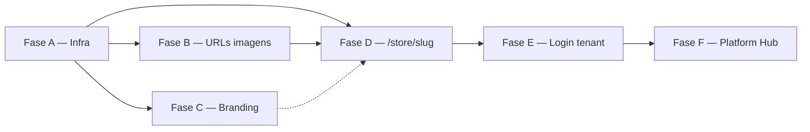

# Spec — Ata Labs Platform (pós-migração)

| Campo | Valor |
|-------|-------|
| **Initiative ID** | `ata-labs-platform` |
| **Pré-requisito** | Migração Lojão Fase 8 `done` |
| **Spec version** | 1.0 |
| **Última atualização** | 2026-06-19 |

---

## 1. Contexto

### 1.1 Produto e marca

| Conceito | Nome | Uso |
|----------|------|-----|
| Empresa | **Ata Labs** | Landing, marketing, hub plataforma |
| Produto SaaS | **Ata Commerce** | E-commerce multi-tenant para lojistas |
| Codinome interno | Lojão (`@lojao/*`, cookie `lojao.sid`, serviços Render `lojao-*`) | **Manter** até refactor interno futuro |

**Domínio registrado:** `atalabs.com.br` (Hostinger; DNS gerenciado na Cloudflare).

### 1.2 Stack atual (monorepo)

| App | Tech | Deploy Render |
|-----|------|---------------|
| `apps/api` | Fastify + TS + Zod | `lojao-api` (sem custom domain no MVP) |
| `apps/admin` | React + Vite | `lojao-admin` → `app.atalabs.com.br` |
| `apps/storefront` | Next.js 15 App Router | `lojao-storefront` → `atalabs.com.br` |
| `packages/db` | Drizzle | Postgres `lojao-db` |

### 1.3 Problema que motiva esta spec

1. **Performance:** imagens em `R2_DELIVERY=proxy` (browser → API Render → R2 → API) consomem bandwidth do plano free (alerta 70% de 5 GB).
2. **Multi-tenant:** produção usa `TENANT_SLUG=loja` fixo — uma loja só.
3. **URLs:** vitrine na raiz (`/`, `/produto/[id]`) — não escala para múltiplos tenants no mesmo host.
4. **Branding:** UI ainda exibe "Lojão".
5. **Plataforma:** não existe hub Ata Labs para CRUD de tenants.

### 1.4 Restrições MVP (Render Free)

- **2 custom domains** no Render — usar para storefront e admin apenas.
- API permanece em `lojao-api.onrender.com` (cookie de sessão neste domínio).
- CDN de imagens via **Cloudflare R2** em `cdn.atalabs.com.br` (não consome slot Render).
- Subdomínios `{tenant}.store` / `{tenant}.admin` **fora do escopo** MVP.

---

## 2. Arquitetura alvo (MVP)

### 2.1 Mapa de hosts

```
┌─────────────────────────────────────────────────────────────────┐
│  atalabs.com.br          → lojao-storefront (Render)            │
│  app.atalabs.com.br      → lojao-admin (Render Static)          │
│  lojao-api.onrender.com  → lojao-api (Render) — cookie sessão   │
│  cdn.atalabs.com.br      → Cloudflare R2 (custom domain)        │
└─────────────────────────────────────────────────────────────────┘
```

### 2.2 Mapa de URLs

#### Storefront — `atalabs.com.br`

| Rota | Página | Fase |
|------|--------|------|
| `/` | Landing Ata Labs | C (conteúdo) + D (redirect opcional) |
| `/planos` | Planos Ata Commerce | C |
| `/demo` | Demo vitrine (opcional) | D |
| `/store/{slug}` | Home vitrine tenant | D |
| `/store/{slug}/produto/{id}` | Detalhe produto | D |
| `/store/{slug}/carrinho` | Carrinho | D |
| `/store/{slug}/checkout` | Checkout | D |
| `/store/{slug}/login` | Login comprador | D |
| `/store/{slug}/cadastro` | Cadastro | D |
| `/store/{slug}/meus-pedidos` | Área comprador | D |

> **Redirect legado (Fase D):** `/produto/[id]` → `/store/{slug}/produto/[id]` (301) quando `TENANT_SLUG` ou slug conhecido; remover após período de transição.

#### Admin — `app.atalabs.com.br`

| Rota | Página | Fase |
|------|--------|------|
| `/login` | Login (identifica tenant) | E |
| `/admin/*` | Painel lojista (`role: admin`) | existente |
| `/platform/*` | Hub Ata Labs (`role: platform_admin`) | F |

### 2.3 Resolução de tenant

| Contexto | Fonte do slug | Mecanismo |
|----------|---------------|-----------|
| Storefront SSR/CSR | Path `/store/{slug}/...` | `packages/tenant-host` → header `X-Tenant-Slug` |
| Admin autenticado | Sessão `tenantSlug` | Setado no login (Fase E) |
| API fallback dev | `TENANT_SLUG` env | Apenas dev/híbrido — **nunca produção** |
| API fallback legado | Header `X-Tenant-Slug` | Mantido para compatibilidade |

Prioridade API (`apps/api/src/plugins/tenant.ts`) — **alvo pós Fase E:**

```
sessão.tenantSlug > header X-Tenant-Slug > subdomínio (ignorar em prod MVP)
(TENANT_SLUG env removido de produção)
```

### 2.4 Sessão e CORS

- Cookie: `lojao.sid` no domínio **`lojao-api.onrender.com`**
- Storefront e admin: `fetch(..., { credentials: 'include' })` para API
- Produção:

```env
COOKIE_SAME_SITE=none
APP_URL=https://atalabs.com.br
ADMIN_URL=https://app.atalabs.com.br
```

CORS (`apps/api/src/app.ts`): origins = `APP_URL` + `ADMIN_URL` + localhost dev.

### 2.5 Imagens (R2 + CDN)

```env
STORAGE_PROVIDER=r2
R2_DELIVERY=cdn
R2_PUBLIC_URL=https://cdn.atalabs.com.br
R2_BUCKET=ata-commerce
```

- Uploads novos retornam URL absoluta `https://cdn.atalabs.com.br/images/{filename}`
- **Não** usar `*.r2.dev` em produção
- `data/uploads/images` = apenas dev local
- Storefront: `NEXT_PUBLIC_CDN_URL` para `assetUrl()` quando path `/images/...`

---

## 3. Protocolo do agente

### Antes de codar

1. Ler [STATUS.md](./STATUS.md) — fase ativa
2. Ler esta spec — seção da fase
3. Ler [TESTING-IMPLEMENTATION.md](../migration/TESTING-IMPLEMENTATION.md)
4. Ler `.cursor/rules/lojao-migration.mdc` e `AGENTS.md`

### Durante

- Implementar **somente** escopo **IN** da fase
- Uma fase por sessão (salvo pedido explícito)
- Não renomear pacotes `@lojao/*` nem cookie `lojao.sid` nesta initiative
- Não quebrar webhooks `/webhook/stripe`, `/webhook/sumup`
- Não relaxar guards admin (`role === 'admin'`)

### Após concluir

1. Verificar DoD da fase
2. Atualizar [STATUS.md](./STATUS.md)
3. Handoff: feito, pendente, riscos

---

## 4. Referência de ambiente (produção)

```env
# ── API (lojao-api) ──
APP_URL=https://atalabs.com.br
ADMIN_URL=https://app.atalabs.com.br
COOKIE_SAME_SITE=none
STORAGE_PROVIDER=r2
R2_DELIVERY=cdn
R2_PUBLIC_URL=https://cdn.atalabs.com.br
R2_BUCKET=ata-commerce
# TENANT_SLUG — NÃO definir em produção

# ── Storefront (build) ──
NEXT_PUBLIC_API_URL=https://lojao-api.onrender.com
NEXT_PUBLIC_ADMIN_URL=https://app.atalabs.com.br
NEXT_PUBLIC_CDN_URL=https://cdn.atalabs.com.br

# ── Admin (build) ──
VITE_API_URL=https://lojao-api.onrender.com
VITE_STOREFRONT_URL=https://atalabs.com.br
```

Webhooks (fixos na URL Render):

- `https://lojao-api.onrender.com/webhook/stripe`
- `https://lojao-api.onrender.com/webhook/sumup`

---

## 5. Dependências entre fases



| Fase | Depende de | Pode paralelizar com |
|------|------------|----------------------|
| A | — | — |
| B | A (R2 CDN ativo) | C |
| C | A (URLs públicas corretas) | B |
| D | A, B (CDN URLs no banco) | C |
| E | D (rotas estáveis) | C |
| F | E (auth + roles) | — |

**Ordem recomendada:** A → B → D → C → E → F

(C pode ser feita em paralelo com B/D se houver capacidade.)

---

# Fase A — Infra: DNS, env Render, CORS, R2 CDN

| Campo | Valor |
|-------|-------|
| **ID** | `ata-a` |
| **Depende de** | Migração Fase 8 `done` |
| **Duração estimada** | 1–2 dias (inclui propagação DNS) |
| **Tipo** | Infra + config (pouco código) |

## Objetivo

Ativar domínio `atalabs.com.br` na Cloudflare, apontar storefront/admin para Render, configurar CDN R2 e variáveis de ambiente para cross-origin cookie e CORS corretos.

## Escopo

### IN

- [ ] Cloudflare: nameservers na Hostinger → status **Active**
- [ ] Remover registros legados Hostinger (A `2.57.91.91`, etc.)
- [ ] DNS Cloudflare (proxy **cinza**/DNS only inicialmente se Render exigir validação):
  - `@` CNAME → `lojao-storefront.onrender.com`
  - `www` CNAME → `lojao-storefront.onrender.com`
  - `app` CNAME → `lojao-admin.onrender.com`
  - `cdn` CNAME → custom domain R2 (Cloudflare dashboard R2)
- [ ] Render: custom domains em `lojao-storefront` e `lojao-admin`
- [ ] Render env API: `APP_URL`, `ADMIN_URL`, `COOKIE_SAME_SITE=none`, `R2_DELIVERY=cdn`, `R2_PUBLIC_URL`
- [ ] Render env storefront: `NEXT_PUBLIC_*` com URLs fixas (não só `RENDER_EXTERNAL_URL`)
- [ ] Render env admin: `VITE_*` com URLs fixas
- [ ] Remover ou documentar que `TENANT_SLUG` permanece até Fase D (não remover ainda se quebrar prod)
- [ ] Atualizar `render.yaml` com valores alvo (comentários + defaults documentados)
- [ ] Atualizar `.env.example` com bloco Ata Labs produção
- [ ] Atualizar `docs/migration/runbooks/render-blueprint.md` — seção domínios Ata Labs
- [ ] Redeploy manual API após storefront/admin no ar (CORS depende de `APP_URL`/`ADMIN_URL`)

### OUT

- Migração URLs no banco (Fase B)
- Refactor rotas storefront (Fase D)
- Custom domain na API Render (custo/limitação free)

## Tarefas detalhadas

### A.1 Cloudflare DNS

1. Confirmar zona `atalabs.com.br` Active
2. Apagar A record antigo Hostinger
3. Criar CNAMEs conforme mapa §2.1
4. SSL/TLS: Full (strict) quando cert Render ativo

### A.2 Cloudflare R2 — custom domain CDN

1. Bucket `ata-commerce` → Settings → Custom Domains → `cdn.atalabs.com.br`
2. Cloudflare cria CNAME automaticamente ou manual conforme UI
3. Validar: `curl -I https://cdn.atalabs.com.br/images/{arquivo-existente}`

### A.3 Render Environment

| Serviço | Variável | Valor |
|---------|----------|-------|
| lojao-api | `APP_URL` | `https://atalabs.com.br` |
| lojao-api | `ADMIN_URL` | `https://app.atalabs.com.br` |
| lojao-api | `R2_DELIVERY` | `cdn` |
| lojao-api | `R2_PUBLIC_URL` | `https://cdn.atalabs.com.br` |
| lojao-storefront | `NEXT_PUBLIC_API_URL` | `https://lojao-api.onrender.com` |
| lojao-storefront | `NEXT_PUBLIC_ADMIN_URL` | `https://app.atalabs.com.br` |
| lojao-storefront | `NEXT_PUBLIC_CDN_URL` | `https://cdn.atalabs.com.br` |
| lojao-admin | `VITE_API_URL` | `https://lojao-api.onrender.com` |
| lojao-admin | `VITE_STOREFRONT_URL` | `https://atalabs.com.br` |

### A.4 Código (mínimo)

- [ ] `apps/storefront/src/lib/api.ts` — `assetUrl()` preferir `NEXT_PUBLIC_CDN_URL` sobre API URL para `/images/*`
- [ ] Documentar env `NEXT_PUBLIC_CDN_URL` em `.env.example`

## Critérios de aceite (DoD)

- [ ] `https://atalabs.com.br` carrega storefront (200)
- [ ] `https://app.atalabs.com.br/login` carrega admin (200)
- [ ] `https://lojao-api.onrender.com/health` → 200
- [ ] Login admin funciona cross-origin (cookie setado, dashboard carrega)
- [ ] Upload novo de imagem retorna URL `https://cdn.atalabs.com.br/images/...`
- [ ] Imagem CDN carrega direto no browser (sem passar pela API)
- [ ] Bandwidth Render para imagens cai (verificar após Fase B completa)
- [ ] `render.yaml` e runbook atualizados
- [ ] STATUS.md Fase A → `done`

## Verificação manual

```bash
curl -sI https://atalabs.com.br | head -5
curl -sI https://app.atalabs.com.br/login | head -5
curl -s https://lojao-api.onrender.com/health
# Após upload teste no admin:
curl -sI "https://cdn.atalabs.com.br/images/{filename}"
```

## Riscos

| Risco | Mitigação |
|-------|-----------|
| Propagação DNS lenta | Aguardar até 48h; testar com `dig` |
| Cookie blocked (SameSite) | `COOKIE_SAME_SITE=none` + HTTPS everywhere |
| Render validação SSL | DNS only (cinza) até cert emitido |
| Imagens antigas ainda `/images/` | Fase B |

---

# Fase B — Migração URLs de imagens + performance

| Campo | Valor |
|-------|-------|
| **ID** | `ata-b` |
| **Depende de** | Fase A `done` (CDN ativo) |
| **Duração estimada** | 0,5–1 dia |

## Objetivo

Migrar URLs relativas `/images/...` e paths proxy no PostgreSQL para URLs absolutas CDN, eliminando tráfego de imagem na API Render.

## Escopo

### IN

- [ ] Script `scripts/migrate-image-urls-to-cdn.ts` (ou SQL idempotente)
- [ ] Tabelas/colunas afetadas (tenant DB):
  - `produto.imagem`, `produto.imagens` (JSON/array se aplicável)
  - `banner.imagem`
  - `loja.logo`, `loja.favicon`
  - Outros campos identificados via grep `/images/`
- [ ] Transformação: `/images/{file}` → `https://cdn.atalabs.com.br/images/{file}`
- [ ] Preservar URLs já absolutas (http/https)
- [ ] Modo dry-run (`--dry-run`) e confirmação (`--apply`)
- [ ] `assetUrl()` storefront: usar `NEXT_PUBLIC_CDN_URL` como base
- [ ] Admin: exibir previews com CDN URL
- [ ] Documentar execução no runbook Render

### OUT

- Re-upload de arquivos ausentes no R2 (manual/separado)
- Otimização de imagem (resize, WebP)

## Script — requisitos

```typescript
// Pseudocódigo
const CDN = process.env.R2_PUBLIC_URL ?? 'https://cdn.atalabs.com.br';
function migratePath(url: string): string {
  if (!url || url.startsWith('http')) return url;
  if (url.startsWith('/images/')) return `${CDN}${url}`;
  return url;
}
```

- Conectar via `DATABASE_URL` (iterar tenants se schema multi-db ou prefixo tenant)
- Log: contagem por tabela, amostra before/after
- Idempotente: rodar 2x não duplica prefixo

## Critérios de aceite (DoD)

- [ ] Dry-run lista alterações sem erro
- [ ] Apply migra 100% dos `/images/` em prod (ou documenta exceções)
- [ ] Home e detalhe produto carregam imagens via CDN (DevTools Network)
- [ ] Nenhuma request de imagem para `lojao-api.onrender.com/images/*` em browse normal
- [ ] Testes vitest do script (unit: função `migratePath`)
- [ ] STATUS.md Fase B → `done`

## Testes

| Tipo | Ação |
|------|------|
| vitest | Função de transformação URL + edge cases |
| Manual | Network tab — imagens só de `cdn.atalabs.com.br` |
| Playwright | Spec smoke vitrine — screenshots/visibilidade img (opcional) |

---

# Fase C — Branding Ata Labs / Ata Commerce

| Campo | Valor |
|-------|-------|
| **ID** | `ata-c` |
| **Depende de** | Fase A (URLs corretas) |
| **Duração estimada** | 1–2 dias |

## Objetivo

Substituir referências visuais "Lojão" por Ata Labs (empresa) e Ata Commerce (produto) na UI e defaults amigáveis.

## Escopo

### IN

- [ ] `apps/admin/index.html` — title, meta
- [ ] Login admin — logo/texto "Ata Commerce"
- [ ] Sidebar admin — marca
- [ ] Storefront `layout.tsx` / metadata — "Ata Commerce" ou nome tenant quando em `/store/{slug}`
- [ ] Landing `/` — conteúdo Ata Labs (hero, CTA planos) — pode ser MVP estático
- [ ] Página `/planos` — tiers placeholder
- [ ] Defaults API bootstrap: `loja_nome: 'Minha Loja'` ou `'Ata Commerce Demo'` (grep `'Lojão'`)
- [ ] `.env.example` — `EMAIL_FROM="Ata Commerce <noreply@atalabs.com.br>"`
- [ ] Favicon/logo placeholder Ata (SVG ou texto)

### OUT (manter)

- Nomes pacotes `@lojao/*`
- Cookie `lojao.sid`
- Serviços Render `lojao-*`
- Nomes de tabela/coluna Postgres

## Arquivos prováveis

| Arquivo | Mudança |
|---------|---------|
| `apps/admin/index.html` | Title |
| `apps/admin/src/routes/login.tsx` | Branding |
| `apps/admin/src/routes/admin/layout.tsx` | Sidebar header |
| `apps/storefront/src/app/layout.tsx` | Metadata default |
| `apps/storefront/src/app/page.tsx` | Landing Ata Labs |
| `apps/storefront/src/app/planos/page.tsx` | Nova página |
| `apps/api/src/**/bootstrap*` ou seed | Default loja nome |

## Critérios de aceite (DoD)

- [ ] Nenhum "Lojão" visível em admin login/sidebar
- [ ] Storefront landing apresenta Ata Labs
- [ ] `/planos` acessível
- [ ] Grep UI: zero "Lojão" em `apps/admin/src`, `apps/storefront/src/app` (exceto comentários)
- [ ] `data-testid`: `landing-hero`, `landing-planos-cta`, `planos-page` (atualizar catálogo)
- [ ] STATUS.md Fase C → `done`

## Testes

| testid | Onde |
|--------|------|
| `landing-hero` | `/` |
| `landing-planos-link` | `/` |
| `planos-page` | `/planos` |
| `admin-login-brand` | `/login` |

Spec Playwright mínima: `apps/e2e/tests/marketing/landing.spec.ts`

---

# Fase D — Multi-tenant path `/store/[slug]`

| Campo | Valor |
|-------|-------|
| **ID** | `ata-d` |
| **Depende de** | Fase A, B |
| **Duração estimada** | 3–5 dias |

## Objetivo

Refatorar storefront para resolver tenant pelo path `/store/{slug}`, criar pacote compartilhado `packages/tenant-host` e remover dependência de `TENANT_SLUG` fixo em produção.

## Escopo

### IN

- [ ] Novo pacote `packages/tenant-host`:
  - `parseStorePath(pathname: string): { slug: string | null; rest: string }`
  - `buildStorePath(slug: string, subpath?: string): string`
  - Testes vitest completos
- [ ] Estrutura Next.js:

```
apps/storefront/src/app/
  page.tsx                    # Landing Ata Labs (já Fase C)
  planos/page.tsx
  store/[slug]/page.tsx       # Home vitrine
  store/[slug]/produto/[id]/page.tsx
  store/[slug]/carrinho/page.tsx
  store/[slug]/checkout/...
  store/[slug]/login/page.tsx
  ...
```

- [ ] Middleware (`middleware.ts`): extrair slug de `/store/{slug}/...`, setar header `x-tenant-slug`
- [ ] `apps/storefront/src/lib/api.ts`: slug dinâmico (param ou header), não env fixo
- [ ] Links internos: usar `buildStorePath(slug, ...)`
- [ ] Redirects 301:
  - `/` com `?legacy=1` ou paths antigos `/produto/[id]` → `/store/{defaultSlug}/produto/[id]`
  - Default slug dev: `loja`; prod demo: `demo`
- [ ] Remover `TENANT_SLUG` / `NEXT_PUBLIC_TENANT_SLUG` de `render.yaml` produção
- [ ] API: em produção, não depender de `TENANT_SLUG` env (warn se setado)
- [ ] E2E: atualizar URLs para `/store/{slug}/...`
- [ ] ISR mantido (`revalidate=60`)

### OUT

- Subdomínio tenant (`{slug}.atalabs.com.br`)
- Middleware auth cross-origin (permanece client-side)

## Pacote tenant-host — API sugerida

```typescript
// packages/tenant-host/src/index.ts
export const STORE_PREFIX = '/store';

export function parseStorePath(pathname: string): {
  slug: string | null;
  storePath: string | null; // rest after /store/{slug}
} {
  const match = pathname.match(/^\/store\/([^/]+)(\/.*)?$/);
  if (!match) return { slug: null, storePath: null };
  return { slug: match[1], storePath: match[2] ?? '/' };
}

export function buildStorePath(slug: string, subpath = '/'): string {
  const normalized = subpath.startsWith('/') ? subpath : `/${subpath}`;
  return `${STORE_PREFIX}/${slug}${normalized === '/' ? '' : normalized}`;
}
```

## Critérios de aceite (DoD)

- [ ] `/store/demo` renderiza vitrine do tenant `demo` (SSR)
- [ ] `/store/demo/produto/1` detalhe funciona
- [ ] Carrinho/checkout/login sob `/store/demo/...`
- [ ] Tenant errado → 404 amigável
- [ ] `TENANT_SLUG` ausente em produção Render
- [ ] vitest `packages/tenant-host` passa
- [ ] E2E smoke store atualizados e verdes
- [ ] Catálogo test-ids atualizado (`store-slug-layout`, etc.)
- [ ] STATUS.md Fase D → `done`

## Testes

| Tipo | Ação |
|------|------|
| vitest | `packages/tenant-host` — paths edge cases |
| vitest API | `resolveSlug` sem env — só header |
| Playwright | Atualizar `apps/e2e/tests/store/*.spec.ts` |

---

# Fase E — Login admin com identificação de tenant

| Campo | Valor |
|-------|-------|
| **ID** | `ata-e` |
| **Depende de** | Fase D |
| **Duração estimada** | 2–3 dias |

## Objetivo

Permitir login no admin identificando o tenant (slug) e persistindo `tenantSlug` na sessão, suportando múltiplas lojas na mesma instância.

## Escopo

### IN

- [ ] UI login (`apps/admin/src/routes/login.tsx`):
  - Campo **slug da loja** OU detecção automática por e-mail (ver abaixo)
  - `data-testid`: `admin-login-slug-input`
- [ ] API `POST /api/v1/auth/login`:
  - Aceitar `tenantSlug` no body (Zod)
  - Validar usuário **no tenant** correto
  - Setar `session.tenantSlug` após login
- [ ] API `GET /api/v1/auth/me`: retornar `tenantSlug`, `lojaNome`
- [ ] Logout limpa `tenantSlug`
- [ ] Admin: links "Ver vitrine" usam `buildStorePath(tenantSlug, '/')` + `VITE_STOREFRONT_URL`
- [ ] Fluxo e-mail único multi-tenant (opcional MVP):
  - Se e-mail existe em um único tenant → auto-resolve slug
  - Se múltiplos → exige slug
- [ ] Seed: tenant `demo` + admin demo

### OUT

- SSO/OAuth
- Convite por link mágico

## Modelo de sessão

```typescript
// session (existente + garantir)
interface SessionData {
  userId: number;
  role: 'admin' | 'comprador' | 'platform_admin';
  tenantSlug: string;
  // ...
}
```

## Critérios de aceite (DoD)

- [ ] Login com slug `demo` → dashboard dados do tenant demo
- [ ] Login slug errado → erro claro (401/404)
- [ ] Sessão persiste `tenantSlug`; reload dashboard ok
- [ ] API admin routes resolvem tenant via sessão (não env)
- [ ] vitest: login com tenantSlug
- [ ] E2E admin login atualizado
- [ ] STATUS.md Fase E → `done`

## Testes

| testid | Onde |
|--------|------|
| `admin-login-slug-input` | Login |
| `admin-login-submit` | Login |

---

# Fase F — Platform Hub + API tenants

| Campo | Valor |
|-------|-------|
| **ID** | `ata-f` |
| **Depende de** | Fase E |
| **Duração estimada** | 4–6 dias |

## Objetivo

Hub Ata Labs no admin (`/platform/*`) para operadores `platform_admin` gerenciarem tenants (CRUD), usando API `/api/v1/platform/tenants`.

## Escopo

### IN

- [ ] Role `platform_admin` (master) — usar `MASTER_EMAIL`/`MASTER_PASSWORD` existentes ou tabela dedicada
- [ ] API routes (`apps/api/src/modules/platform/`):
  - `GET /api/v1/platform/tenants` — listar
  - `POST /api/v1/platform/tenants` — criar (slug, nome, plano)
  - `GET /api/v1/platform/tenants/:slug`
  - `PATCH /api/v1/platform/tenants/:slug` — suspender, renomear
  - Guard: `role === 'platform_admin'`
- [ ] Provisionamento: criar schema/tables tenant (reutilizar bootstrap existente)
- [ ] Admin UI (`apps/admin/src/routes/platform/`):
  - `/platform/tenants` — lista
  - `/platform/tenants/novo` — form
  - `/platform/tenants/:slug` — detalhe/edit
- [ ] Layout platform separado (nav Ata Labs)
- [ ] Redirect: platform_admin logado → `/platform/tenants`; admin lojista → `/admin/dashboard`
- [ ] Tipos em `packages/types`

### OUT

- Billing Asaas integrado ao hub (futuro)
- Custom domain por tenant
- Exclusão hard de tenant (soft-delete/suspend only no MVP)

## Critérios de aceite (DoD)

- [ ] Login master → `/platform/tenants`
- [ ] Criar tenant `acme` → `/store/acme` funciona (vitrine vazia ok)
- [ ] Login admin do tenant `acme` isolado de `demo`
- [ ] Lojista comum não acessa `/platform/*` (403 → redirect)
- [ ] vitest rotas platform
- [ ] E2E smoke platform (criar tenant, login lojista)
- [ ] testids: `platform-tenants-list`, `platform-tenant-create-form`
- [ ] STATUS.md Fase F → `done`

## Testes

| testid | Onde |
|--------|------|
| `platform-tenants-list` | Lista |
| `platform-tenant-create-slug` | Form |
| `platform-tenant-create-submit` | Form |

---

## 6. Matriz de arquivos-chave

| Área | Arquivos |
|------|----------|
| Tenant API | `apps/api/src/plugins/tenant.ts` |
| Sessão | `apps/api/src/plugins/session.ts`, `apps/api/src/modules/auth/*` |
| CORS | `apps/api/src/app.ts` |
| R2 | `apps/api/src/adapters/storage/r2-image-storage.ts`, `create-image-storage.ts` |
| Storefront tenant | `apps/storefront/src/middleware.ts`, `src/lib/api.ts`, `src/app/store/[slug]/**` |
| Tenant parser | `packages/tenant-host/src/index.ts` |
| Admin rotas | `apps/admin/src/App.tsx`, `src/routes/login.tsx`, `src/routes/platform/**` |
| Deploy | `render.yaml`, `docs/migration/runbooks/render-blueprint.md` |
| Env | `.env.example` |
| Migração imgs | `scripts/migrate-image-urls-to-cdn.ts` |
| E2E | `apps/e2e/tests/store/*`, `apps/e2e/tests/admin/*` |
| Test IDs | `packages/test-utils/src/test-ids/*`, `docs/migration/test-ids-catalog.md` |

---

## 7. Registro de riscos

| ID | Risco | Impacto | Mitigação |
|----|-------|---------|-----------|
| R1 | Render free bandwidth | Site lento, suspensão | Fase A+B CDN |
| R2 | Cookie third-party bloqueado | Login falha | SameSite=none; documentar browsers |
| R3 | URLs imagens quebradas pós migração | UX ruim | Dry-run B; backup DB |
| R4 | Redirect loop `/` vs `/store` | SEO | Regras claras middleware |
| R5 | Tenant slug collision | 404/ wrong store | Validação slug único na API |
| R6 | MASTER vs platform_admin | Auth confusa | Documentar um role canonical |

---

## 8. Fora de escopo (esta initiative)

- Renomear monorepo/pacotes `@lojao` → `@ata`
- Custom domain API (`api.atalabs.com.br`) — avaliar com plano pago
- VPS self-hosted
- Wildcard DNS tenant subdomains
- Migração e-mail transacional completa
- App mobile

---

## 9. Comandos de verificação (todas as fases)

```bash
pnpm install
pnpm turbo typecheck
make test-api
pnpm test:all          # api + e2e smoke
```

Após Fase D+, garantir `E2E_STORE_URL` apontando para `/store/demo`.

---

## 10. Glossário

| Termo | Definição |
|-------|-----------|
| Tenant | Loja isolada (schema/slug) no multi-tenant |
| Slug | Identificador URL-safe (`demo`, `acme`) |
| Platform admin | Operador Ata Labs (hub) |
| Store admin | Lojista (`role: admin`) |
| CDN delivery | Imagens servidas direto do R2 via `cdn.atalabs.com.br` |
| Proxy delivery | Imagens servidas pela API (`/images/*`) — **legado prod** |

---

## Changelog

| Versão | Data | Autor | Mudanças |
|--------|------|-------|----------|
| 1.0 | 2026-06-19 | Agente | Spec inicial A–F a partir do handoff |
