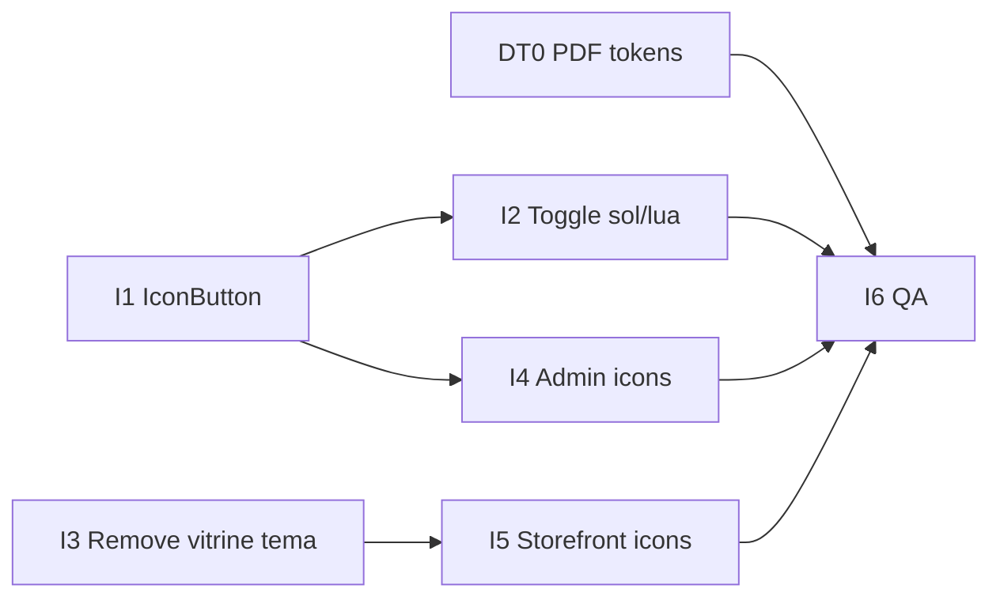

# Spec — Dark Theme System + Ícones (react-icons)

| Campo | Valor |
|-------|-------|
| **Initiative ID** | `dark-theme-icons` |
| **Parent** | [design-system.md](./design-system.md) · [THEME-MIGRATION-PLAN.md](../design/THEME-MIGRATION-PLAN.md) (Fases 0–7 concluídas) · PDF [`AtaLabs_-_Dark_Theme_System.pdf`](../design/AtaLabs_-_Dark_Theme_System.pdf) |
| **Motivação** | Alinhar cores admin/platform ao manual Dark Theme; UX mobile-first com ícones; simplificar toggle de tema; remover configuração de tema da vitrine |
| **Spec version** | 1.0 |
| **Última atualização** | 2026-06-30 |
| **Status** | `done` — ver [dark-theme-icons-STATUS.md](./dark-theme-icons-STATUS.md) |

---

## 1. Problema

### 1.1 Dark Theme

A Fase 7 do design system entregou tokens semânticos (`--admin-*`, `--platform-*`) com base no manual **Identidade Visual**. O PDF **Dark Theme System** (jun/2026) refina papéis de cor, contraste e hierarquia para modo escuro — possivelmente com deltas vs. `semantic-admin.css` / `semantic-platform.css` atuais.

**Gap:** audit manual DT0 não foi feito; tokens podem divergir do PDF.

### 1.2 Ícones e mobile-first

| Situação atual | Impacto |
|----------------|---------|
| Ações CRUD em **texto** (“Remover”, “Excluir”, “Editar”) | Ocupa largura em tabelas mobile; touch targets inconsistentes |
| Toggle tema = **Switch + label** “Tema claro” | Ocupa ~120px na sidebar; pior em login/my-stores |
| Sidebar admin **sem ícones** por rota | Scan visual lento no celular |
| Vitrine nav **só texto** (Carrinho, Sair…) | Sem affordance visual; header sem menu mobile |
| **`react-icons` ausente** | Só `lucide-react` em primitivos shadcn (`XIcon`, `MenuIcon`) |

### 1.3 Tema vitrine (`loja_tema`)

O fluxo `loja_tema` (escuro/claro) existe end-to-end:

- Admin Aparência → API `configuracoes` → storefront `data-store-theme`

**Decisão produto (2026-06-25, fechada nesta spec):**

- Light/dark é **somente** preferência do operador no **admin lojista** e **Platform Hub Atalabs**
- **Remover** toggle `loja_tema` da UI Aparência
- **Fixar** vitrine em tema **escuro** (`DEFAULT_STORE_THEME`)
- Visitante **nunca** troca tema na loja

---

## 2. Decisões fechadas

| # | Decisão |
|---|---------|
| D1 | Biblioteca app-level: **`react-icons`** (subconjunto Heroicons + Feather), instalada em `@lojao/ui` |
| D2 | **`lucide-react`** permanece **só** em primitivos shadcn gerados (`dialog`, `sheet`, `select` chevrons) — não misturar na UI de produto |
| D3 | Toggle admin/platform: **botão ícone** sol/lua alternável — **sem** Switch, **sem** label “Tema claro” |
| D4 | Área mínima do botão ícone: **48×48px** (`min-h-12 min-w-12`), `aria-label` + `title` descritivos |
| D5 | Vitrine: **`data-store-theme="escuro"`** fixo; API pode manter coluna `loja_tema` no DB (backward compat) mas UI/admin não edita |
| D6 | Ícones destrutivos (excluir/remover): variante `destructive`, cor `--admin-error` / `--platform-error` |
| D7 | Sidebar admin: ícone + label em desktop; **ícone-only** aceitável em mobile colapsado (tooltip/`aria-label`) |
| D8 | Texto permanece onde reduz ambiguidade: CTAs primários (“Salvar aparência”), confirmações em `ConfirmDialog`, empty states |

---

## 3. Escopo

### 3.1 Incluído

| Área | Escopo |
|------|--------|
| **Tokens** | Audit PDF → delta em `semantic-admin.css`, `semantic-platform.css` (DT0) |
| **`@lojao/ui`** | `IconButton`, `ThemeIconToggle`, mapa de ícones exportado |
| **Admin** | Toggle sol/lua; ícones shell + CRUD (I4) |
| **Platform Hub** | Toggle sol/lua; ícones shell + tenants (I4) |
| **Aparência** | Remover seção tema vitrine (I3) |
| **Storefront vitrine** | Ícones nav/carrinho/produto; tema fixo escuro (I5) |
| **Testes** | Atualizar E2E theme + aparência; smoke ícones |
| **Docs** | `UX-PRINCIPLES.md`, `design-system.md` §11, `test-ids-catalog.md` |

### 3.2 Fora de escopo

| Item | Motivo |
|------|--------|
| Toggle light/dark na vitrine (visitante) | Decisão produto D5 |
| Migrar primitivos shadcn de lucide → react-icons | Risco/regeneração CLI |
| Marketing `/`, `/pricing`, signup | SVGs inline já existentes; initiative separada se necessário |
| Reescrever `ChartCard` | Só ajuste de cor se DT0 exigir |
| Migration DB drop column `loja_tema` | Manter valor `escuro`; remoção física = backlog |
| Legacy EJS | Sem `data-testid`, sem Playwright |

---

## 4. Arquitetura

### 4.1 Camadas de ícone

```
┌─────────────────────────────────────────────────────────┐
│  Apps (admin, storefront)                               │
│  import { IconButton, HiOutlineTrash, ThemeIconToggle } │
│  from '@lojao/ui'                                       │
└───────────────────────────┬─────────────────────────────┘
                            │
┌───────────────────────────▼─────────────────────────────┐
│  packages/ui                                            │
│  icon-button.tsx · theme-icon-toggle.tsx                │
│  icons/index.ts — reexport react-icons (tree-shake)     │
└───────────────────────────┬─────────────────────────────┘
                            │
         ┌──────────────────┴──────────────────┐
         │                                     │
┌────────▼────────┐               ┌───────────▼──────────┐
│ react-icons     │               │ lucide-react         │
│ (produto UI)    │               │ (shadcn primitivos)  │
└─────────────────┘               └──────────────────────┘
```

### 4.2 Componentes novos (`@lojao/ui`)

#### `IconButton`

```tsx
interface IconButtonProps {
  icon: React.ReactNode;
  label: string;           // aria-label obrigatório
  onClick?: () => void;
  href?: string;
  variant?: 'ghost' | 'destructive' | 'accent';
  size?: 'md' | 'lg';      // md = 44px, lg = 48px (default lg)
  testId?: string;
  disabled?: boolean;
  type?: 'button' | 'submit';
}
```

- Usa tokens `--admin-*` ou `--platform-*` via prop `surface: 'admin' | 'platform' | 'store'`
- Hover/focus com `--admin-focus-ring`
- Exportar helpers: `TrashIconButton`, `EditIconButton`, `ExternalLinkIconButton` (opcional, fase I4)

#### `ThemeIconToggle`

Substitui `AdminUiThemeSwitch` / `PlatformUiThemeSwitch`:

| Estado | Ícone | aria-label |
|--------|-------|------------|
| Tema escuro ativo | Sol (`HiOutlineSun` ou `FiSun`) | “Ativar tema claro” |
| Tema claro ativo | Lua (`HiOutlineMoon` ou `FiMoon`) | “Ativar tema escuro” |

- `data-testid`: manter `admin-ui-theme-switch` / `platform-ui-theme-switch` (compat E2E)
- Posição: sidebar footer, login, my-stores, platform login/layout — **mesmo componente**, prop `surface`

### 4.3 Mapa de ícones (padrão)

| Ação | react-icons sugerido | Onde |
|------|---------------------|------|
| Excluir / Remover | `HiOutlineTrash` | CRUD tabelas, carrinho |
| Editar | `HiOutlinePencil` | Produtos, categorias, banners, chat |
| Ver / Detalhes | `HiOutlineEye` | Pedidos, compradores, produtos |
| Adicionar / Criar | `HiOutlinePlus` | FAB/list headers |
| Salvar | `HiOutlineCheck` | Forms (opcional ao lado do texto) |
| Cancelar / Fechar | `HiOutlineXMark` | Forms inline |
| Voltar | `HiOutlineArrowLeft` | Breadcrumbs mobile |
| Sair / Logout | `HiOutlineArrowRightOnRectangle` | Sidebar footer |
| Carrinho | `HiOutlineShoppingCart` | Store nav |
| Pedidos | `HiOutlineClipboardDocumentList` | Store nav |
| Menu mobile | `HiOutlineBars3` | Store header (novo) |
| Tema claro | `HiOutlineSun` | ThemeIconToggle |
| Tema escuro | `HiOutlineMoon` | ThemeIconToggle |
| Vitrine externa | `HiOutlineArrowTopRightOnSquare` | Sidebar “Ver vitrine” |
| Trocar loja | `HiOutlineBuildingStorefront` | Merchant Hub |
| Dashboard | `HiOutlineHome` | Sidebar |
| Categorias | `HiOutlineTag` | Sidebar |
| Produtos | `HiOutlineCube` | Sidebar |
| Pedidos | `HiOutlineShoppingBag` | Sidebar |
| Configurações | `HiOutlineCog6Tooth` | Sidebar |
| Relatórios | `HiOutlineChartBar` | Sidebar |
| Permissões | `HiOutlineShieldCheck` | Sidebar |
| Chat | `HiOutlineChatBubbleLeftRight` | Sidebar |
| Agenda | `HiOutlineCalendar` | Sidebar |
| Banners | `HiOutlinePhoto` | Sidebar |
| Aparência | `HiOutlinePaintBrush` | Sidebar |
| Compradores | `HiOutlineUsers` | Sidebar |

**Regra:** importar de `@lojao/ui/icons` (barrel), nunca `react-icons/hi2` direto nos apps.

---

## 5. Inventário codebase — candidatos a ícone

### 5.1 Toggle tema (substituir I2)

| Arquivo | Linhas | Atual |
|---------|--------|-------|
| `apps/admin/src/components/admin-ui-theme-switch.tsx` | 13–35 | Switch + “Tema claro” |
| `apps/admin/src/components/platform-ui-theme-switch.tsx` | 12–35 | idem |
| `apps/admin/src/routes/admin/layout.tsx` | 58 | `<AdminUiThemeSwitch />` |
| `apps/admin/src/routes/login.tsx` | 64 | idem |
| `apps/admin/src/routes/my-stores.tsx` | 82 | idem |
| `apps/admin/src/routes/platform/layout.tsx` | 42 | `<PlatformUiThemeSwitch />` |
| `apps/admin/src/routes/platform-login.tsx` | 50 | idem |

### 5.2 Remover `loja_tema` UI (I3)

| Arquivo | Ação |
|---------|------|
| `apps/admin/src/routes/admin/aparencia/index.tsx` | Remover Switch tema (L215–231), state `tema`, preview `data-store-theme={tema}` → fixo `escuro` |
| `packages/types/src/aparencia.ts` | Manter campo opcional na API; documentar deprecated |
| `apps/api/src/modules/aparencia/aparencia.service.ts` | Continuar default `escuro`; ignorar PUT `claro` **ou** forçar `escuro` |
| `apps/storefront/src/app/store/[slug]/layout.tsx` | `data-store-theme="escuro"` fixo (ignorar API ou sempre parse → escuro) |
| `apps/e2e/tests/store/vitrine.spec.ts` | Assert `data-store-theme="escuro"` |
| `apps/e2e/tests/admin/aparencia.spec.ts` | Remover assert `temaSwitch` se existir |
| `packages/test-utils/.../admin-aparencia.ts` | Deprecar `temaSwitch` testid |

### 5.3 Admin — shell e navegação (I4.1)

| Texto atual | Arquivo | Ícone |
|-------------|---------|-------|
| 12 links sidebar | `admin/layout.tsx` NAV_ITEMS | Mapa §4.3 |
| Ver vitrine | `admin/layout.tsx` ~70 | External link |
| Trocar loja | ~79 | BuildingStorefront |
| Sair | ~93 | Logout |
| Platform: Lojas, Sair | `platform/layout.tsx` | Chart + Logout |
| Entrar na loja | `my-stores.tsx` ~156 | ArrowRight |
| + Nova loja | `platform/tenants/index.tsx` | Plus |

### 5.4 Admin — CRUD por módulo (I4.2–I4.6)

| Módulo | Arquivo | Botões texto → ícone |
|--------|---------|---------------------|
| **Produtos lista** | `admin/produtos/index.tsx` | Ver, Editar, Excluir; ✓ estoque |
| **Produtos edit** | `admin/produtos/edit.tsx` | × remover imagem → Trash IconButton |
| **Categorias** | `admin/categorias/index.tsx` | Editar, Remover; + Criar |
| **Banners** | `admin/banners/index.tsx` | Editar, Desativar/Ativar, Excluir |
| **Permissões** | `admin/permissoes/index.tsx` | Suspender/Ativar, Remover |
| **Chat** | `admin/chat/index.tsx` | Editar, Excluir resposta |
| **Agenda** | `admin/agenda/index.tsx` | Remover dia especial |
| **Pedidos** | `admin/pedidos.tsx`, `detail.tsx` | Ver, Voltar, paginação ←/→ |
| **Compradores** | `admin/compradores/*` | Ver ficha, Voltar |
| **Dashboard** | `admin/dashboard.tsx` | Ver todos → chevron/link |
| **Platform tenants** | `platform/tenants/*` | Ver vitrine, Detalhes, Voltar, Salvar |

**Padrão tabela mobile (I4):**

- Desktop: ícone + texto curto **ou** ícone com tooltip
- `< sm`: coluna “Ações” só `IconButton`s em `flex gap-2`
- Manter `ConfirmDialog` com labels textuais nos botões confirmar/cancelar

### 5.5 Storefront vitrine (I5)

| Componente | Arquivo | Mudança |
|------------|---------|---------|
| **StoreNav** | `components/layout/store-nav.tsx` | Carrinho, Pedidos, Sair, Entrar com ícones |
| **StoreHeader** | `components/layout/store-header.tsx` | Menu hamburger mobile + Sheet (padrão marketing-header) |
| **ProductCard** | `components/product-card.tsx` | Ícone carrinho no “Adicionar” (opcional compact) |
| **CartView** | `components/cart-view.tsx` | “Remover” → Trash IconButton; qty −/+ com ícones |
| **AddToCartButton** | `components/add-to-cart-button.tsx` | Leading cart icon |
| **Banner carousel** | `components/banner-carousel.tsx` | Setas já têm aria-label — migrar para react-icons via `@lojao/ui` |

**Não incluir:** toggle tema vitrine.

### 5.6 Já parcialmente com ícone

| Local | Atual | Ação |
|-------|-------|------|
| `packages/ui/src/layout-admin.tsx` | `MenuIcon` lucide | Migrar para `HiOutlineBars3` **ou** manter lucide (decisão: migrar em I4 para consistência) |
| shadcn Dialog/Sheet | `XIcon` lucide | **Manter** lucide (D2) |
| Produtos imagem | `×` + aria-label | Substituir por Trash IconButton (I4) |

---

## 6. Dark Theme — audit PDF (fase DT0)

### 6.1 Fonte

- PDF: [`docs/design/AtaLabs_-_Dark_Theme_System.pdf`](../design/AtaLabs_-_Dark_Theme_System.pdf)
- Baseline código: `packages/design-tokens/src/semantic-admin.css`, `semantic-platform.css`

### 6.2 Procedimento DT0

1. Ler PDF seção por seção (Admin Commerce azul + Platform Labs verde)
2. Preencher tabela §6.3 para **cada token semântico**
3. Aplicar deltas **somente** onde PDF diverge do Identidade Visual já implementado
4. Validar contraste WCAG AA (texto ≥ 4.5:1) escuro **e** claro
5. Screenshots antes/depois: login admin, dashboard, platform tenants (375px + 1280px)
6. Rodar `STRICT=1 make check-design`

### 6.3 Tabela de audit (preencher na implementação DT0)

> **Audit completo:** [dark-theme-icons-DT0-audit.md](./dark-theme-icons-DT0-audit.md) (2026-06-30)

| Token `--admin-*` | Valor anterior (escuro) | Valor PDF | Delta? | Ação |
|-------------------|-------------------------|-----------|--------|------|
| `--admin-bg` | `--ata-azul-hero-inicio` (#0a1f5c) | `#13151A` | ☑ | `--ata-dt-admin-bg-base` |
| `--admin-surface` | `--ata-azul-noite` | `#191C24` | ☑ | `--ata-dt-admin-bg-surface` |
| `--admin-text` | `#ffffff` | `#EEF0F4` | ☑ | off-white |
| `--admin-text-muted` | `--ata-azul-ceu` | `#8892A4` | ☑ | cinza secundário |
| `--admin-border` | mix comercio 22% | `#252B38` | ☑ | sólido |
| `--admin-accent` | `--ata-azul-comercio` | `#2E8FFB` | ☑ | `--ata-azul-vivido` |
| `--admin-sidebar-*` | azul-noite + mix | surface/active/hover PDF | ☑ | mapeamento 1:1 |
| `--admin-input-*` | mix azul-noite | surface + border PDF | ☑ | neutros |
| `--admin-error/success/warning` | hex existentes | (não no PDF) | ☐ | mantidos |
| `--platform-*` (espelhar) | verde hero/conde | neutros PDF | ☑ | ver audit completo |

### 6.4 Critérios de aceite DT0

- [ ] Tabela §6.3 100% preenchida no PR ou anexo STATUS
- [ ] Zero regressão visual óbvia vs. protótipos Ata
- [ ] `make check-design` verde
- [ ] Swatch `/admin/diagnostico` reflete novos tokens

---

## 7. Fases e Definition of Done

> **Regra:** uma fase por sessão. Atualizar [dark-theme-icons-STATUS.md](./dark-theme-icons-STATUS.md) ao iniciar/concluir.

### DT0 — Audit PDF → tokens

| Item | Detalhe |
|------|---------|
| **ID** | `dt0` |
| **Entregável** | Delta tokens em `semantic-admin.css` / `semantic-platform.css` |
| **DoD** | §6.4 completo |

### I1 — Foundation react-icons + IconButton

| Item | Detalhe |
|------|---------|
| **ID** | `icons-i1` |
| **Arquivos** | `packages/ui/package.json` (+ `react-icons`), `src/icon-button.tsx`, `src/icons/index.ts`, export em `index.ts` |
| **DoD** | `IconButton` com `surface`, `testId`, 48px touch; Story/snapshot opcional; typecheck verde |

### I2 — Toggle sol/lua (admin + platform)

| Item | Detalhe |
|------|---------|
| **ID** | `icons-i2` |
| **Arquivos** | `theme-icon-toggle.tsx`; refatorar `admin-ui-theme-switch.tsx`, `platform-ui-theme-switch.tsx` |
| **DoD** | Sem Switch/label visível; E2E `theme.spec.ts` verde; persistência localStorage inalterada |

### I3 — Remover tema vitrine

| Item | Detalhe |
|------|---------|
| **ID** | `icons-i3` |
| **Arquivos** | §5.2 |
| **DoD** | Aparência sem toggle; vitrine sempre escuro; testes API/E2E atualizados; preview Aparência usa tema fixo |

### I4 — Ícones admin CRUD + shell

| Item | Detalhe |
|------|---------|
| **ID** | `icons-i4` |
| **Subfases** | I4.1 shell · I4.2 produtos/categorias · I4.3 banners/permissoes · I4.4 pedidos/compradores · I4.5 agenda/chat/config · I4.6 platform |
| **DoD** | Inventário §5.3–5.4 coberto; ações destrutivas com `variant="destructive"`; mobile 375px validado |

### I5 — Ícones storefront (sem toggle tema)

| Item | Detalhe |
|------|---------|
| **ID** | `icons-i5` |
| **Arquivos** | §5.5 |
| **DoD** | Nav com ícones; header mobile menu; carrinho trash icon; vitrine permanece escuro |

### I6 — QA + docs + CI

| Item | Detalhe |
|------|---------|
| **ID** | `icons-i6` |
| **Entregável** | Atualizar `UX-PRINCIPLES.md`, `design-system.md` §11, `test-ids-catalog.md`; smoke Playwright novos testids |
| **DoD** | Checklist STATUS §“Checklist visual” marcado; `pnpm test:all` verde |

---

## 8. Testes automatizados

### 8.1 Testids (manter / adicionar)

| testId | Componente | Fase |
|--------|------------|------|
| `admin-ui-theme-switch` | `ThemeIconToggle` admin | I2 (manter id) |
| `platform-ui-theme-switch` | `ThemeIconToggle` platform | I2 |
| `admin-aparencia-tema-switch` | **Remover** | I3 |
| `admin-icon-delete-{id}` | IconButton excluir | I4 (novo padrão) |
| `store-nav-cart` | Link carrinho | I5 |
| `store-header-menu` | Menu mobile | I5 |

Atualizar `packages/test-utils/src/test-ids/` e `docs/migration/test-ids-catalog.md`.

### 8.2 Specs E2E

| Arquivo | Mudança |
|---------|---------|
| `apps/e2e/tests/admin/theme.spec.ts` | Clicar botão ícone (testid inalterado) |
| `apps/e2e/tests/store/vitrine.spec.ts` | `data-store-theme="escuro"` fixo |
| `apps/e2e/tests/admin/aparencia.spec.ts` | Sem assert tema vitrine |

### 8.3 API

| Arquivo | Mudança |
|---------|---------|
| `apps/api/tests/integration/admin.aparencia.test.ts` | Remover ou ajustar teste PUT `loja_tema: claro` |

---

## 9. Ordem de implementação recomendada



**Paralelo possível:** DT0 independente de I1; I3 independente de I2.

---

## 10. Prompts por fase (copy-paste)

Ver `docs/specs/prompts/dark-theme-icons/` (criar na fase I6 ou sob demanda):

```
Implemente fase {ID} da spec docs/specs/dark-theme-icons-spec.md.
Leia dark-theme-icons-STATUS.md e marque in_progress → done ao concluir.
DoD: seção 7 da spec. Testes: §8. Uma fase por sessão.
```

---

## 11. Referências

- [UX-PRINCIPLES.md](../design/UX-PRINCIPLES.md) — mobile-first, touch 48px
- [TESTING-STRATEGY.md](../migration/TESTING-STRATEGY.md)
- [shadcn-ui-migration-spec.md](./shadcn-ui-migration-spec.md) — convivência lucide/shadcn
- [test-ids-catalog.md](../migration/test-ids-catalog.md)

---

## Changelog spec

| Data | Versão | Mudança |
|------|--------|---------|
| 2026-06-25 | 0.9 | Análise codebase + STATUS (chat anterior) |
| 2026-06-30 | 1.0 | Spec completa: inventário, fases, arquitetura, decisão remover `loja_tema` UI |
