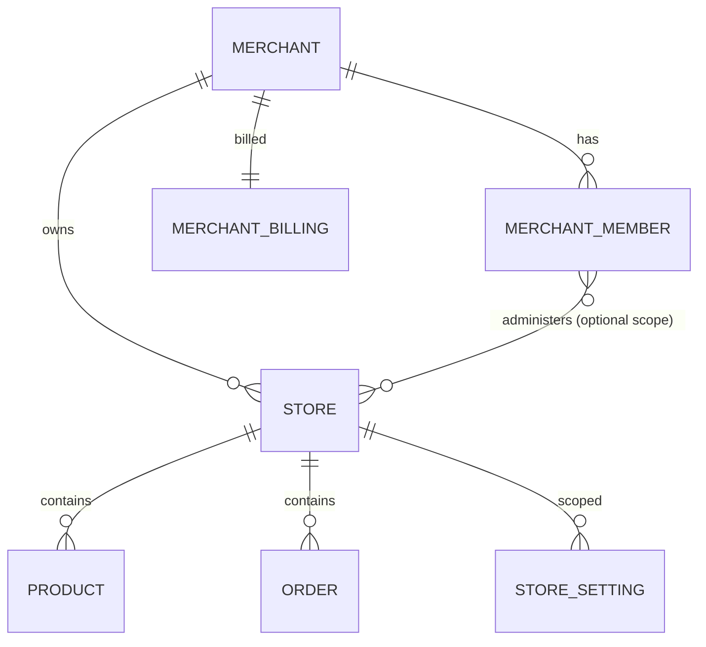

# Spec — Arquitetura Merchant Account (conta → lojas)

| Campo | Valor |
|-------|-------|
| **Initiative ID** | `merchant-account` (fases **MA0–MA9**) |
| **Parent** | [ata-labs-platform-spec.md](./ata-labs-platform-spec.md) |
| **Pré-requisito** | Fix crítico isolamento (interim database-per-store) documentado em [multi-tenant-isolation-fix.md](./multi-tenant-isolation-fix.md) |
| **Spec version** | 1.0 |
| **Última atualização** | 2026-07-01 |
| **Status** | `done` (MA0–MA9 concluídas; ver [merchant-account-STATUS.md](./merchant-account-STATUS.md)) |

### Decisão de produto (2026-07-01) — schema em inglês

Todo o banco **greenfield MA** usa **inglês** para tabelas, colunas, keys de settings e status persistidos. UI/API user-facing permanece **pt-BR**. Catálogo completo: **[db-schema-english.md](./db-schema-english.md)**.

### Decisão de produto (2026-07-01) — greenfield

**Não migrar** dados, contas nem mapeamento da estrutura `tenants` / database-per-store.

- Banco e schema **novos** do zero (`merchants`, `stores`, merchant DB com `store_id`).
- **Descartar** tabela `tenants`, plugin `resolveSlug` por tenant, scan cross-DB, `repairTenantIsolation`, bootstrap de demo legado.
- Produção: **reset controlado** (ou ambiente novo) + clientes recriam conta via signup.
- O fix interim database-per-store serve só até o **cutover MA**; não é arquitetura a preservar.

---

## 1. Problema

O modelo atual trata **cada loja (`tenants.slug`) como unidade raiz**:

- 1 linha em `tenants` = 1 loja = 1 banco PostgreSQL (`<db>_<store_slug>`)
- Billing amarrado a `tenant_id` (= loja)
- Merchant Hub descobre lojas **varrendo todos os tenants** e procurando o e-mail admin em cada banco
- Plano (“até N lojas”) **não existe** como entidade — só planos de produto genéricos
- Signup cria **loja + admin** soltos, sem **conta do cliente**

Isso contradiz o produto desejado desde o início:

> **Cliente Rogério** (conta Ata Commerce) pode ter **Loja A, B, C** conforme o plano, com produtos, pedidos, compradores e config **por loja**, dentro da **mesma conta**.

---

## 2. Modelo alvo

### 2.1 Entidades (conceito)



| Entidade | Descrição | Exemplo |
|----------|-----------|---------|
| **Merchant** (conta) | Cliente pagante Ata Commerce | Rogério Ltda (`merchant_slug: rogerio`) |
| **Store** (loja) | Vitrine + admin escopado | `camisetas`, `canecas` |
| **Merchant member** | Usuário da conta (owner, admin, operador) | `rogerio@email.com` |
| **Buyer** (`usuario` role) | Comprador **por loja** (ou global no merchant DB com `store_id`) | Cliente final |

### 2.2 Isolamento de dados

| Camada | Decisão |
|--------|---------|
| **Master DB** (`DATABASE_URL`) | `merchants`, `stores`, `merchant_members`, `sessions`, `merchant_billing`, `billing_plans`, … (ver [db-schema-english.md](./db-schema-english.md)) |
| **Merchant DB** (1 por conta) | `atacommerce_<merchant_slug>` — `products`, `orders`, … + **`store_id`** |
| **Entre merchants** | Bancos físicos separados (isolamento forte) |
| **Entre lojas do mesmo merchant** | `store_id` + índices compostos; queries **sempre** filtram por loja ativa |

Nomenclatura de banco: ver [naming-policy.md](./naming-policy.md) — prefixo **`atacommerce_`**, nunca `lojao_`.

### 2.3 Sessão e contexto de request

Campos de sessão (substituem `tenantSlug`/`tenant_id` legados):

| Campo | Significado |
|-------|-------------|
| `merchantId` | Conta ativa |
| `merchantSlug` | Slug da conta (URL interna, suporte) |
| `storeId` | Loja selecionada no admin |
| `storeSlug` | Slug da vitrine `/store/{storeSlug}` |
| `memberId` | Usuário admin da conta |
| `role` | `owner` \| `admin` \| `operator` \| `platform_admin` |

Prioridade de resolução na API (storefront):

```
path /store/{storeSlug} → storeId (validar merchant ativo + store ativa)
```

Prioridade no admin autenticado:

```
sessão.storeId (+ merchantId) — obrigatório para rotas /admin/*
```

### 2.4 Limites de plano

| Plano | Lojas (`max_stores`) | Produtos / usuários (por loja ou conta — definir na MA2) |
|-------|----------------------|-----------------------------------------------------------|
| Starter | 1 | 50 produtos, 1 usuário admin |
| Professional | 3 | 500 produtos, 5 usuários |
| Enterprise | contrato | ilimitado |

Enforcement:

- `POST /merchants/:id/stores` → 403 `STORE_LIMIT_REACHED` se `COUNT(stores) >= plan.max_stores`
- Signup cria merchant + **primeira store** (não store solta)

### 2.5 Fluxos de produto

#### Signup self-service

1. Cria **merchant** + **owner member** (senha) + **store #1** (nome + slug vitrine)
2. Provisiona **`atacommerce_<merchant_slug>`** + seed config da store
3. Trial em `merchant_billing`
4. Login → se `max_stores > 1` ou já tem 2+ stores → Merchant Hub lista **stores da conta** (query simples no master), não scan cross-DB

#### Merchant Hub (`/admin/my-stores`)

- Lista `stores` WHERE `merchant_id = session.merchantId` AND member has access
- Selecionar loja → `POST /auth/select-store` → set `storeId` + `storeSlug` na sessão
- Trocar loja → limpar cache admin (já implementado) + trocar `storeId`

#### Vitrine

- `/store/{storeSlug}` — slug **único globalmente** (constraint master.stores.slug UNIQUE)
- Dados públicos: API resolve store → merchant DB → filtra `store_id`

---

## 3. Schema proposto (master — inglês)

Ver mapeamento legado PT → EN em [db-schema-english.md](./db-schema-english.md).

```sql
-- MA1 baseline (greenfield)
CREATE TABLE merchants (
  id SERIAL PRIMARY KEY,
  slug VARCHAR(50) NOT NULL UNIQUE,
  name VARCHAR(150) NOT NULL,
  active BOOLEAN DEFAULT true,
  db_name VARCHAR(100) NOT NULL,
  db_host VARCHAR(100) NOT NULL,
  db_port INTEGER NOT NULL DEFAULT 5432,
  db_user VARCHAR(100) NOT NULL,
  db_password VARCHAR(100) NOT NULL,
  created_at TIMESTAMP DEFAULT NOW()
);

CREATE TABLE stores (
  id SERIAL PRIMARY KEY,
  merchant_id INTEGER NOT NULL REFERENCES merchants(id) ON DELETE CASCADE,
  slug VARCHAR(50) NOT NULL UNIQUE,
  name VARCHAR(100) NOT NULL,
  active BOOLEAN DEFAULT true,
  created_at TIMESTAMP DEFAULT NOW()
);

CREATE TABLE merchant_members (
  id SERIAL PRIMARY KEY,
  merchant_id INTEGER NOT NULL REFERENCES merchants(id) ON DELETE CASCADE,
  email VARCHAR(255) NOT NULL,
  name VARCHAR(255) NOT NULL,
  password_hash TEXT NOT NULL,
  role VARCHAR(20) NOT NULL DEFAULT 'owner',
  active BOOLEAN DEFAULT true,
  created_at TIMESTAMP DEFAULT NOW(),
  UNIQUE (merchant_id, email)
);

-- merchant_billing (merchant_id), billing_plans, invoices, sessions, …
```

### Substituição de `tenants` (sem convivência)

| Fase | Ação |
|------|------|
| MA1 | Criar `merchants`, `stores`, `merchant_members`; **não** estender `tenants` |
| MA8 | Cutover: dropar `tenants`, `tenant_billing.tenant_id`, código tenant legado |
| MA9 | Remover código morto (tenant-db interim, database-per-store, bootstrap repair) |

**Sem** `tenants_legacy`, **sem** mapa e-mail→merchant, **sem** import de bancos `lojao_*` / `atacommerce_*` por loja antiga.

---

## 4. Schema proposto (merchant DB — inglês + store_id)

Baseline Drizzle em `packages/db/src/schema/merchant/` — **zero** nomes PT. Mapeamento completo: [db-schema-english.md](./db-schema-english.md) §4.

Todas as tabelas de negócio incluem **`store_id INTEGER NOT NULL`** (validação app; FK lógica para `stores.id` no master).

| Tabela (EN) | Escopo |
|-------------|--------|
| `products`, `categories`, `banners`, `orders`, `store_settings`, `chat_conversations`, … | `store_id` |
| `buyers` | `store_id` (comprador por loja) |
| Admins | **Somente** `merchant_members` no master |
| `login_attempts` | Master (recomendado) |

Índices compostos: `(store_id, …)`. Uniques compostos: ex. `UNIQUE(store_id, key)` em `store_settings`.

---

## 5. API — mudanças principais

| Área | Hoje | Alvo |
|------|------|------|
| Plugin tenant | `resolveSlug` → pool por tenant slug | `resolveStore` → merchant pool + `request.storeId` |
| Admin routes | `request.db` sem filtro store | Todas queries + `WHERE store_id = $storeId` |
| Auth login | Scan N bancos por e-mail | `SELECT` em `merchant_members` + join `stores` |
| Signup | `createTenant(slug)` | `createMerchant` + `createStore` + provision 1 DB |
| Platform hub | CRUD `tenants` | CRUD `merchants` + stores nested |
| Billing | `tenant_id` | `merchant_id` |

Rotas novas (exemplo):

- `POST /api/v1/auth/select-store` `{ storeSlug }`
- `GET /api/v1/auth/my-stores` → stores da conta (substitui scan)
- `POST /api/v1/merchants/:merchantId/stores` — criar loja #2, #3…

---

## 6. Frontend

| App | Mudança |
|-----|---------|
| Admin | Query keys incluem `storeSlug` ou `storeId`; Merchant Hub lista stores da conta |
| Storefront | Sem mudança de URL `/store/[slug]` — slug passa a ser **store**, não tenant/conta |
| Signup | Coletar nome da **empresa/conta** + nome/slug da **primeira loja** |

---

## 7. Cutover greenfield (MA8)

**Sem migração de dados legados.**

### Pré-cutover

1. Comunicar janela de manutenção (se houver tráfego em produção).
2. Backup do Postgres atual **apenas para arquivo frio** (opcional); **não** importar na stack nova.

### Cutover

1. **Reset** master DB: migrations MA1+ (`merchants`, `stores`, `merchant_members`, `merchant_billing`, `sessao`).
2. **Remover** bancos físicos legados (`lojao`, `lojao_*`, database-per-store interim) — `DROP DATABASE` em dev/staging; produção na janela acordada.
3. Deploy API/admin/storefront **somente** código MA (plugin `resolveStore`, auth por `merchant_members`, signup merchant+store).
4. Seed **opcional** mínimo: 1 merchant demo + 1 store demo para QA (não copiar catálogo antigo).
5. Platform admin: recriar credenciais `platform_admin` via env/bootstrap MA.

### Pós-cutover

- Signup self-service = único caminho de onboarding.
- Clientes anteriores **recadastram** conta (mesmo e-mail permitido).
- Billing recomeça (trial/signup); sem reconciliação com `tenant_id` antigo.

### Rollback

- Restaurar backup **inteiro** do Postgres legado + deploy commit anterior — **não** rollback parcial.
- Janela de rollback documentada no runbook MA8 (máx. 7 dias recomendado).

---

## 8. Fases de implementação

| Fase | ID | Entrega | DoD resumido |
|------|-----|---------|--------------|
| 0 | **MA0** | Spec + naming + **db EN** | Docs aprovadas; greenfield; [db-schema-english.md](./db-schema-english.md) |
| 1 | **MA1** | Master schema EN | `merchants`, `stores`, `merchant_members`, `sessions`, … |
| 2 | **MA2** | Merchant DB baseline EN + `store_id` | Drizzle `schema/merchant/`; migration `0001_*` |
| 3 | **MA3** | Provisionamento `atacommerce_<merchant_slug>` | Signup/platform; remove database-per-store |
| 4 | **MA4** | Sessão `merchantId` + `storeId`; plugin `resolveStore` | API admin/storefront filtram store |
| 5 | **MA5** | Auth + Merchant Hub refatorados | Login O(1); remove scan cross-DB |
| 6 | **MA6** | Signup + criar loja adicional | Enforcement `max_stores` |
| 7 | **MA7** | Billing por merchant | Faturas/comissão por conta |
| 8 | **MA8** | **Cutover greenfield** | Reset DB; drop legado; runbook |
| 9 | **MA9** | Limpeza código morto | Zero referências a `tenants` / tenant plugin legado |

**Uma fase MA por sessão**, como migração original.

### Código legado a **remover** (não manter em paralelo)

| Remover após MA | Motivo |
|-----------------|--------|
| Tabela `tenants` | Substituída por `merchants` + `stores` |
| Schema PT (`produtos`, `pedidos`, `sessao`, …) | Substituído por schema EN (MA2) |
| `tenant-db.ts` / database-per-store | Substituído por merchant DB + `store_id` |
| `repairTenantIsolation`, `BOOTSTRAP_TENANT_SLUGS` | Só existiam para dados legados |
| `findAdminTenantsWithEmail` (scan N DBs) | Substituído por query master |
| `createTenant` / platform CRUD `tenants` | `createMerchant` + stores nested |
| Plugin `resolveSlug` + `tenantPreHandler` | `resolveStore` + `storePreHandler` |

### Interim (até MA3/MA8)

O fix **database-per-store** ([multi-tenant-isolation-fix.md](./multi-tenant-isolation-fix.md)) evita vazamento **enquanto** o código legado ainda roda. Será **deletado** no cutover — não evoluir esse caminho.

---

## 9. Testes

| Tipo | Caso |
|------|------|
| vitest | Merchant com 2 stores: produto na A não aparece na B |
| vitest | `max_stores=1` bloqueia 2ª loja |
| vitest | Login lista stores só da conta |
| e2e | Signup → 2 lojas (plano pro) → troca no hub → dashboard correto |
| e2e | Vitrine `/store/a` vs `/store/b` isoladas |

Query keys admin: `['admin', storeSlug, 'dashboard', 'stats']`.

---

## 10. Fora de escopo (MA)

- Renomear pacotes `@lojao/*` (initiative separada)
- Renomear cookie `lojao.sid`
- Renomear serviços Render
- Subdomínio `{store}.atalabs.com.br`

---

## 11. Decisões abertas (resolver em MA1/MA2)

1. **Comprador cross-loja:** mesmo e-mail pode comprar em loja A e B? (Recomendado: sim, registros separados por `store_id`.)
2. **Slug da conta vs slug da loja:** signup exige ambos ou deriva merchant slug do e-mail?
3. **Operador por loja:** `merchant_members` com tabela `member_store_access` ou role global na conta?
4. **JSON da API v1:** manter campos pt-BR no response durante MA ou migrar payloads para EN na mesma fase? (Recomendado: EN no backend + mapeamento pt só na UI legada até refactor admin.)

## 11.1 Decisões fechadas

| Decisão | Valor |
|---------|-------|
| Idioma do schema | **Inglês** (tabelas, colunas, settings keys, status) |
| Dados legados | **Greenfield** — sem migração |
| UI / copy | **pt-BR** |

---

## 12. Referências

- [naming-policy.md](./naming-policy.md)
- [db-schema-english.md](./db-schema-english.md)
- [admin-merchant-hub-spec.md](./admin-merchant-hub-spec.md) (hub atual — substituído em MA5)
- [multi-tenant-isolation-fix.md](./multi-tenant-isolation-fix.md) (interim)
- Código atual: `apps/api/src/plugins/tenant.ts`, `resolve-login-tenant.ts`, `platform.service.ts`
