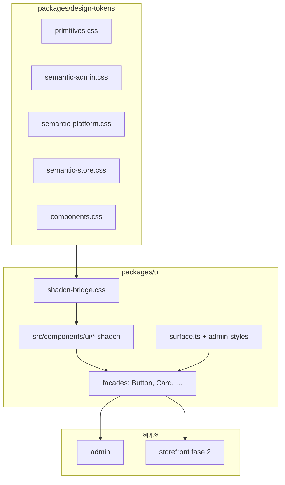

# Spec — Migração shadcn/ui (`@lojao/ui`)

| Campo | Valor |
|-------|-------|
| **Initiative ID** | `shadcn-ui` |
| **Parent** | [design-system.md](./design-system.md) · pós [THEME-MIGRATION-PLAN.md](../design/THEME-MIGRATION-PLAN.md) (Fases 0–7) |
| **Motivação** | Acessibilidade (Radix), componentização padrão de mercado, menos UI ad hoc; scrollbars e forms complexos |
| **Spec version** | 1.0 |
| **Última atualização** | 2026-06-23 |
| **Status** | `in_progress` — ver [shadcn-ui-migration-STATUS.md](./shadcn-ui-migration-STATUS.md) |

---

## 1. Problema

O kit atual `@lojao/ui` (`packages/ui`) cobre o essencial (Button, Card, Table, Switch, Sidebar) com tokens `--admin-*` / `--platform-*`, mas:

- Inputs, selects, dialogs e dropdowns são **HTML nativo + classes** espalhadas nas rotas admin (~15 telas CRUD).
- Switch/Button custom **não** usam Radix — foco, teclado e ARIA dependem de implementação manual.
- Sidebar e tabelas usam scroll nativo (mitigado com `.ds-scrollbar`, mas sem `ScrollArea` acessível).
- Storefront **não** consome `@lojao/ui` — checkout e auth duplicam padrões.
- Evolução (Sheet mobile, Combobox produtos, DatePicker agenda) exigiria reimplementar primitivos.

**Objetivo:** adotar [shadcn/ui](https://ui.shadcn.com/) **dentro de** `packages/ui`, mantendo tokens Ata e API estável onde possível (Strangler Fig).

---

## 2. Escopo

### 2.1 Incluído

| Área | Escopo |
|------|--------|
| **Host** | `packages/ui` — único lugar dos componentes shadcn (`src/components/ui/*`) |
| **Apps fase 1** | `apps/admin` (React + Vite + Tailwind 4) |
| **Apps fase 2** | `apps/storefront` vitrine/checkout (Next.js 15) — após piloto admin |
| **Temas** | Bridge `--admin-*` / `--platform-*` → variáveis shadcn (`--background`, `--primary`, …) |
| **Substituição** | Componentes já exportados por `@lojao/ui` (ver §5) |
| **Novos** | Dialog, Select, DropdownMenu, Sheet, Tabs, Input, Label, Textarea, Badge, Alert, Separator, ScrollArea |
| **Testes** | Manter `data-testid`; smoke Playwright inalterado ou estendido |
| **Governança** | `STRICT=1 make check-design` continua verde |

### 2.2 Fora de escopo (nesta initiative)

| Item | Motivo |
|------|--------|
| Reescrever **ChartCard** / Recharts | Domínio específico; só estilizar com tokens |
| **LayoutAdmin**, **Sidebar** estrutura | Layout de produto; evoluir com Sheet mobile, não substituir por template shadcn |
| Toggle vitrine visitante | Decisão de produto fechada — [UX-PRINCIPLES.md](../design/UX-PRINCIPLES.md) |
| Migrar marketing HTML/EJS legacy | Fora do monorepo TS |
| Trocar Tailwind por outra stack | Tailwind 4 permanece |
| Remover `packages/design-tokens` | shadcn **consome** tokens, não substitui |

---

## 3. Arquitetura alvo



### 3.1 Regras

1. **Apps importam só `@lojao/ui`** — nunca `@radix-ui/*` direto nas rotas.
2. **Facilities (facades)** em `packages/ui/src/button.tsx` etc. reexportam shadcn com props `surface`, `testId`, variantes de produto.
3. **shadcn puro** exportado como `@lojao/ui/dialog`, `@lojao/ui/select`, … para casos avançados (opcional fase posterior).
4. **`cn()`** passa a usar `tailwind-merge` + `clsx` (padrão shadcn); reexportar de `@lojao/ui`.
5. **CSS:** bridge carregado em `apps/admin/src/index.css` **antes** de `components.css`.

### 3.2 Bridge de tema (CSS)

Arquivo novo: `packages/design-tokens/src/shadcn-bridge.css` (ou `packages/ui/src/shadcn-bridge.css`).

Mapeamento **admin escuro** (exemplo — validar visualmente):

| Variável shadcn | Fonte semântica |
|-----------------|-----------------|
| `--background` | `--admin-bg` |
| `--foreground` | `--admin-text` |
| `--card` | `--admin-surface` |
| `--card-foreground` | `--admin-text` |
| `--primary` | `--admin-accent` |
| `--primary-foreground` | `#ffffff` |
| `--secondary` | `--admin-surface-elevated` |
| `--muted` | `--admin-surface-elevated` |
| `--muted-foreground` | `--admin-text-muted` |
| `--border` | `--admin-border` |
| `--input` | `--admin-input-border` |
| `--ring` | `--admin-focus-ring` |
| `--destructive` | `--admin-error` |

Escopos:

```css
[data-admin-ui-theme='escuro'],
[data-admin-ui-theme='claro'] { /* mapa admin */ }

[data-platform-ui-theme='escuro'],
[data-platform-ui-theme='claro'] { /* mapa platform — sobrescreve quando [data-ui-surface='platform'] */ }
```

**Contexto platform:** layouts platform definem `data-ui-surface="platform"` no root (já existe em `LayoutAdmin`). Bridge usa `:is([data-ui-surface='platform'])` para variávis shadcn da paleta verde.

**Vitrine (fase 2):** escopo `[data-store-theme]` → tokens `--store-*`.

---

## 4. Setup técnico (Fase S0)

### 4.1 Dependências (`packages/ui`)

```json
{
  "dependencies": {
    "@lojao/types": "workspace:*",
    "@radix-ui/react-slot": "^1.x",
    "class-variance-authority": "^0.7.x",
    "clsx": "^2.x",
    "tailwind-merge": "^2.x"
  },
  "peerDependencies": {
    "react": "^19.0.0",
    "react-dom": "^19.0.0"
  }
}
```

Radix por componente adicionado via CLI shadcn (Switch, Dialog, Select, …).

### 4.2 `components.json` (monorepo)

Local: `packages/ui/components.json`

```json
{
  "$schema": "https://ui.shadcn.com/schema.json",
  "style": "new-york",
  "rsc": false,
  "tsx": true,
  "tailwind": {
    "config": "",
    "css": "src/styles/shadcn.css",
    "baseColor": "neutral",
    "cssVariables": true
  },
  "aliases": {
    "components": "@/components",
    "utils": "@/lib/utils",
    "ui": "@/components/ui",
    "lib": "@/lib",
    "hooks": "@/hooks"
  },
  "iconLibrary": "lucide-react"
}
```

`tsconfig` paths em `packages/ui`: `"@/*": ["./src/*"]`.

Comando (sessão S0):

```bash
cd packages/ui
pnpm dlx shadcn@latest init
# Responder: New York, zinc/neutral, css variables, src/components/ui
```

### 4.3 Tailwind 4

- Admin já usa `@tailwindcss/vite` v4 — shadcn recente suporta v4 via `@theme inline` no CSS gerado.
- Validar build `pnpm --filter admin build` após init.
- Storefront: repetir bridge em `globals.css` na fase S5.

### 4.4 Exports (`packages/ui/package.json`)

```json
{
  "exports": {
    ".": "./src/index.ts",
    "./button": "./src/components/ui/button.tsx",
    "./dialog": "./src/components/ui/dialog.tsx"
  }
}
```

Facilities públicas permanecem no export `"."` para não quebrar imports existentes.

---

## 5. Mapa de substituição — componentes atuais

| Componente atual | Arquivo | shadcn base | Estratégia | Prioridade |
|------------------|---------|-------------|------------|------------|
| `Button` | `button.tsx` | `button` | Facade: manter `surface`, `variant`, `testId` via `data-testid` | S1 |
| `Card` | `card.tsx` | `card` | Facade: prop `title` → `CardHeader`+`CardTitle` interno | S1 |
| `Switch` | `switch.tsx` | `switch` | Facade: `onChange(bool)`, `testId`, `surface` (classes track) | S1 |
| `Table` + sub | `table.tsx` | `table` | Substituir markup; manter `surface` para cores de borda/hover | S2 |
| `Sidebar` | `sidebar.tsx` | — + `scroll-area` | Manter `<aside>`; `<nav>` usa `ScrollArea` | S4 |
| `LayoutAdmin` | `layout-admin.tsx` | — | Sem mudança estrutural; opcional `Sheet` mobile S4 | S4 |
| `ChartCard` | `chart-card.tsx` | `card` | Card shadcn por baixo; manter slot chart | S2 |
| `chart-theme` | `chart-theme.ts` | — | Manter | — |
| `admin-styles` | `admin-styles.ts` | `badge`, `skeleton` | Migrar badges → `Badge`; skeleton → `Skeleton` | S2 |
| `surface` helpers | `surface.ts` | `input`, `label` | `adminInputClass` → `<Input>` gradual por rota | S3 |
| `.ds-input` CSS | `components.css` | `input` | Manter fallback até rotas migradas | S3 |

### 5.1 Compatibilidade de API (facades)

Contratos **não quebrar** sem deprecation:

```typescript
// Button — mantido
interface ButtonProps {
  variant?: 'primary' | 'secondary' | 'ghost';
  surface?: 'admin' | 'platform';
  'data-testid'?: string;
  // …ButtonHTMLAttributes
}

// Switch — mantido
interface SwitchProps {
  checked: boolean;
  onChange: (checked: boolean) => void;
  label: string;
  testId?: string;
  surface?: 'admin' | 'platform';
}

// Card — mantido
interface CardProps {
  title?: ReactNode;
  surface?: 'admin' | 'platform';
}
```

Mapeamento shadcn:

| Prop legado | shadcn |
|-------------|--------|
| `variant="primary"` | `variant="default"` |
| `variant="secondary"` | `variant="secondary"` |
| `variant="ghost"` | `variant="ghost"` |

---

## 6. Inventário de uso (admin)

Contagem de imports `@lojao/ui` (2026-06-23):

| Export | Rotas / componentes |
|--------|---------------------|
| `Button` | login, my-stores, CRUD, platform, banners, … (~25) |
| `Card` | dashboard, platform tenants, diagnostico |
| `Table*` | pedidos, produtos, categorias, compradores, relatorios, … |
| `Switch` | admin-ui-theme-switch, platform-ui-theme-switch, swatch |
| `Sidebar`, `LayoutAdmin` | admin/layout, platform/layout |
| `ChartCard`, `useChartTheme` | dashboard charts |
| `admin*Class` / `platform*Class` | todas as rotas admin |

**Storefront:** 0 imports — fase S5 introduz `@lojao/ui` no checkout/auth.

---

## 7. Fases de entrega

Uma fase por sessão (salvo pedido explícito). Atualizar [shadcn-ui-migration-STATUS.md](./shadcn-ui-migration-STATUS.md) ao concluir cada fase.

### Fase S0 — Fundação (0,5 sessão)

**Entregáveis:**

- [ ] `components.json` + deps Radix/CVA/tailwind-merge em `packages/ui`
- [ ] `shadcn-bridge.css` admin + platform
- [ ] Import bridge em `apps/admin/src/index.css`
- [ ] `src/lib/utils.ts` (`cn` shadcn)
- [ ] Documentar comandos em `packages/ui/README.md`

**DoD:** `pnpm turbo typecheck --filter=@lojao/ui --filter=admin`; build admin OK; zero regressão visual login.

---

### Fase S1 — Primitivos (1 sessão)

**Adicionar via CLI:** `button`, `card`, `switch`, `badge`, `label`, `input`

**Substituir facades:**

- [ ] `button.tsx` → wrapper shadcn
- [ ] `card.tsx` → wrapper shadcn
- [ ] `switch.tsx` → wrapper Radix Switch

**DoD:** smoke `@smoke` login + theme.spec + dashboard; `data-testid` nos mesmos nós; screenshots opcionais.

---

### Fase S2 — Dados e feedback (1 sessão)

**Adicionar:** `table`, `skeleton`, `tabs`, `alert`, `separator`

**Substituir:**

- [ ] `table.tsx`
- [ ] `ChartCard` usa `Card` shadcn
- [ ] `adminStatusBadgeClass` → `Badge` variant map
- [ ] Relatórios: avaliar `Tabs` vs `adminPeriodPillClass` (manter pills se visual Ata exigir)

**DoD:** pedidos + produtos smoke; tabelas com scroll horizontal + `.ds-scrollbar`.

---

### Fase S3 — Formulários e overlays (1–2 sessões)

**Adicionar:** `dialog`, `select`, `dropdown-menu`, `textarea`, `checkbox`, `form` (react-hook-form + zod opcional)

**Migrar rotas (ordem):**

| Ordem | Rota | Uso principal |
|-------|------|---------------|
| S3.1 | `configuracoes` | inputs, toggles |
| S3.2 | `aparencia` | file + color + select tema |
| S3.3 | `produtos/edit`, `categorias/edit` | forms longos |
| S3.4 | `banners/form` | upload + select produto |
| S3.5 | `pedidos/detail` | ações status (DropdownMenu) |
| S3.6 | `platform/tenants/*` | CRUD platform |

**DoD:** zero `<input className={adminInputClass` nos paths migrados; Dialog confirmações destrutivas com foco preso.

---

### Fase S4 — Layout mobile (0,5 sessão)

**Adicionar:** `sheet`, `scroll-area`

- [ ] Sidebar nav → `ScrollArea` (substituir ou complementar `.ds-scrollbar`)
- [ ] Admin mobile: `Sheet` menu hamburger `< lg`
- [ ] Platform idem

**DoD:** layout 375px — nav acessível; contraste AA; E2E theme intacto.

---

### Fase S5 — Storefront piloto (1 sessão)

- [ ] `@lojao/ui` dependency em `apps/storefront`
- [ ] Bridge `[data-store-theme]` em `globals.css`
- [ ] Migrar `login-form`, `checkout-form` → Input/Button shadcn facades
- [ ] Manter `--cor-primaria` tenant só em CTA (`btn-primary` ou `Button variant`)

**DoD:** smoke vitrine + checkout; vitrine **sem** toggle visitante.

---

### Fase S6 — Limpeza e governança (0,5 sessão)

- [ ] Remover implementações mortas (old button/card/switch se 100% migrado)
- [ ] Atualizar `design-system.md` §12 shadcn
- [ ] Atualizar `test-ids-catalog.md`
- [ ] `STRICT=1 make check-design` + `pnpm test:all` smoke

**DoD final:** `@lojao/ui` documentado; nenhum import duplicado de Radix nos apps.

---

## 8. Testes automatizados

Seguir [TESTING-STRATEGY.md](../migration/TESTING-STRATEGY.md).

| Tipo | Ação |
|------|------|
| **testid** | Facades propagam `data-testid` / `testId` — nunca remover |
| **Smoke** | Rodar `@smoke` após S1, S2, S4 |
| **Novos** | S1: snapshot opcional Button variants; S3: dialog abre/fecha com ESC |
| **API** | Sem mudança |
| **A11y** | Radix Switch/Dialog — spot check axe no login (manual ou `@axe-core/playwright` backlog) |

Specs afetados:

- `apps/e2e/tests/admin/theme.spec.ts` — inalterado
- `apps/e2e/tests/admin/login.spec.ts` — inalterado
- Atualizar `relatorios.spec.ts` se Tabs substituir pills

---

## 9. Riscos e mitigação

| Risco | Mitigação |
|-------|-----------|
| Regressão visual 25+ telas | Fases S1–S3 por módulo; facades estáveis |
| Tailwind 4 + shadcn incompatível | S0 valida build; pin versão CLI |
| Bundle size (Radix) | Import por componente; tree-shaking |
| Conflito tokens vs shadcn defaults | Bridge CSS; nunca hardcode zinc |
| Duplicar `cn` | Um export `@lojao/ui` |
| Storefront RSC | `rsc: false` no components.json; wrappers client onde necessário |

---

## 10. Rollback

Por fase:

1. Reverter facade para implementação anterior (git).
2. Manter `components/ui/*` no repo — não importar.
3. Bridge CSS isolado — remover import em `index.css` reverte cores shadcn.

---

## 11. Critérios de aceite (initiative completa)

- [ ] 100% exports legados de `@lojao/ui` index funcionam ou têm deprecation documentada
- [ ] Admin CRUD usa shadcn para inputs, tables, dialogs nos paths §S3
- [ ] Tokens Ata (`--admin-*`, `--platform-*`) são a única fonte de cor — `make check-design` verde
- [ ] Nenhum `gray-*` / `#2563eb` reintroduzido
- [ ] README `packages/ui` com “como adicionar componente shadcn”
- [ ] STATUS.md initiative `done`

---

## 12. Referências

- [shadcn/ui docs](https://ui.shadcn.com/docs)
- [Radix primitives](https://www.radix-ui.com/primitives)
- [design-system.md](./design-system.md) §11 temas semânticos
- [THEME-MIGRATION-PLAN.md](../design/THEME-MIGRATION-PLAN.md)
- [UX-PRINCIPLES.md](../design/UX-PRINCIPLES.md)

---

## Changelog

| Data | Versão | Mudança |
|------|--------|---------|
| 2026-06-23 | 1.0 | Spec inicial — fases S0–S6, mapa de componentes, bridge de tema |
